# <center>华东师范大学数据科学与工程学院实验报告</center>

|课程名称:操作系统 | 年级:22级 | 上机实践成绩: |
| ---- | ---- | ---- |
| 指导教师:翁楚良 | 姓名:郭夏辉 | 学号:10211900416 |
| 上机实践名称:chrt进程管理 | 上机实践日期:2023年4月13日 | 上机实践编号:No.02 |
| 组号:1-416 | 上机实践时间:2023年4月13日 |      |

## 1.目标

1.巩固操作系统的进程调度机制和策略 

2.熟悉MINIX系统调用和MINIX调度器的实现


## 2.实验要求

在MINIX3中实现Earliest-Deadline-First近似实时调度功能：

1.提供设置进程执行期限的系统调度chrt (long deadline)，用于将调用该系统调用的进程设为实时进程，其执行的期限为：从调用处开始deadline秒。例如：

```c
#include <unistd.h>
……
chrt(10);/* 该程序将可以运行的最长时间为10秒，若没有运行结束，则
强制结束*/
……

```

chrt的定义： int chrt(long deadline); /*deadline 是最后期限值(秒)，返回值1表示成功，返回值0表示该调用出错 */

2.在内核进程表中需要增加一个条目，用于表示进程的实时属性；修改相关代码，新增一个系统调用 chrt，用于设置其进程表中的实时属性。

3.修改 proc.c 和 proc.h 中相关的调度代码，实现最早 deadline 的用户进程相对于其它用户进程具有更高的优先级，从而被优先调度运行。

4.在用户程序中，可以在不同位置调用多次 chrt 系统调用，在未到 deadline 之前，调用 chrt 将会改变该程序的 deadline。

5.未调用 chrt 的程序将以普通的用户进程(非实时进程)在系统中运行。

MINIX3中的系统调用结构分成三个层次：应用层，服务层，内核层。在这三层中分别进行代码修改，实现系统调用chrt的信息传递。从应用层用_syscall将信息传递到服务层，在服务层用 _kernel_call将信息传递到内核层，在内核层对进程结构体增加 deadline成员。

## 3.实验环境

编辑与开发:Visual Studio Code 

虚拟机系统:MINIX 3.3 

物理机系统:Windows 10 专业版 19042.1110 

虚拟机程序:VMware Workstation 16 Pro 

连接虚拟机:MobaXterm Professional v20.0

## 4.实验过程

### 4.0准备阶段

#### 4.0.1下载minix3.3.0源码并编译、安装

```
cd /usr
git clone git://git.minix3.org/minix src # 联机下载代码
cd src
git branch –a # 查看代码版本
git checkout R3.3.0 # 将代码版本切换为3.3.0
#也可以手动下载并解压到相同位置
```

但是在联网下载时碰到了这样的问题:

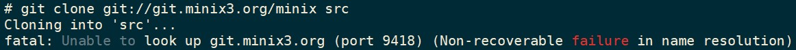

原因和解决方案在此(https://blog.csdn.net/weixin_51376533/article/details/123866628)我把虚拟机的连接模式改成了NAT模式立马就好了。

```
cd /usr/src  
make build #首次编译，或者修改了头文件，Makefile时使用，时间较长。
make build MKUPDATE=yes #增量式编译，适用于少量C源代码修改时使用。
reboot #重启，默认情况下自动选择latest kernel（新生成的kernel）， 需要原始版本时手工选择。
```

整体思路大概是这样的:

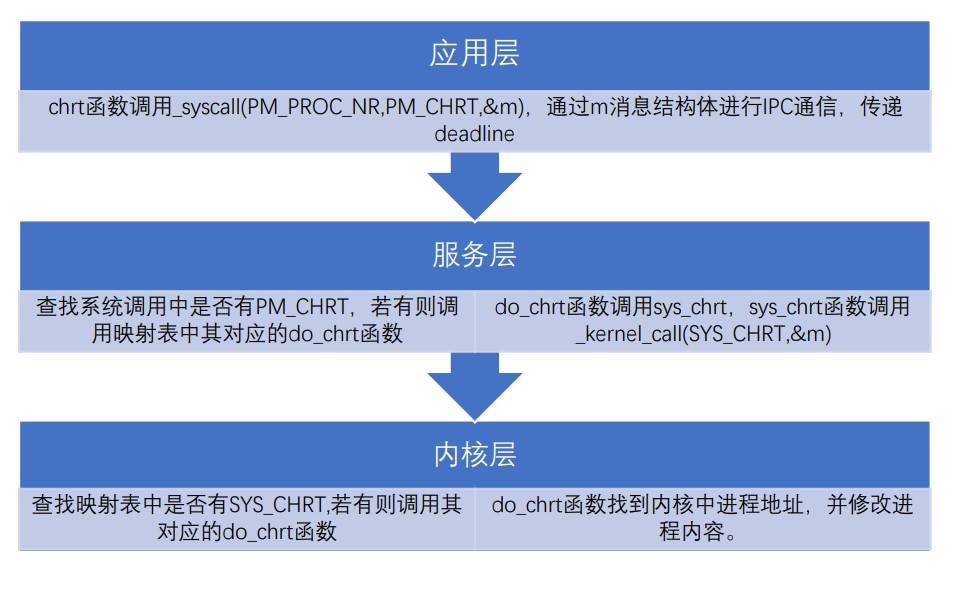

### 4.1应用层

先看一下实验文档:

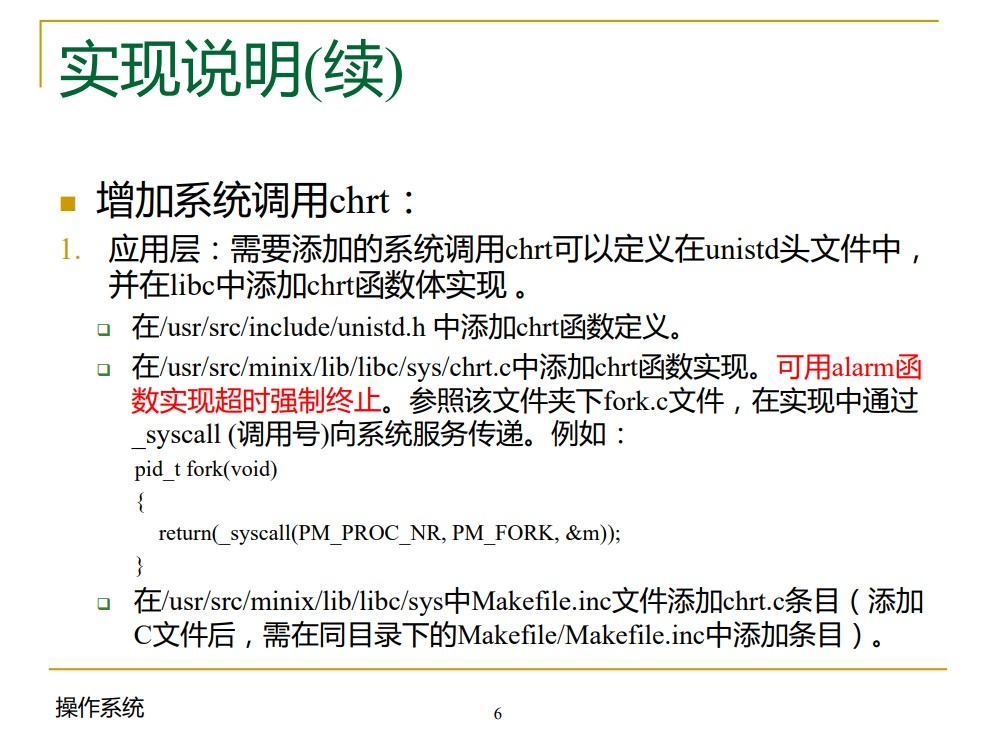

#### 4.1.1准备工作

1在/usr/src/include/unistd.h 中添加chrt函数定义

```c
int chrt(long deadline);
```

2在/usr/src/minix/lib/libc/sys中Makefile.inc文件添加chrt.c条目（添加 C文件后，需在同目录下的Makefile/Makefile.inc中添加条目）

Makefile.inc文件添加chrt.c条目:

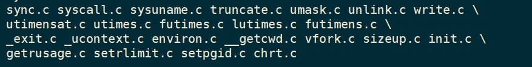

3.在/usr/src/minix/lib/libc/sys中新增文件 chrt.c

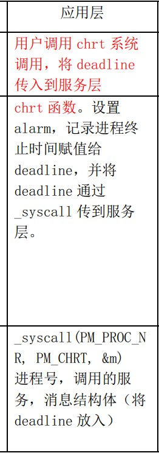

这一层我要做什么具体任务呢?其实主要就是在chrt.c中实现三件事:

1. 设置 `alarm`
2. 将 `deadline` 设置为进程的终止时间
3. 通过 `MINIX` 的 `IPC` 通信机制（通过`message`结构体来传输信息），将 `deadline` 传到服务层

#### 4.1.2设置alarm

```c
unsigned int alarm(unsigned int seconds);
```

从调用alarm开始，设置了一个定时器，持续 seconds秒，当超过这个时间时，产生一个 `SIGALRM` 信号，默认操作是终止调用 alarm的进程。此时有一个小细节，就是这里的seconds是`unsigned int`无符号类型的，但是我们输入的deadline却是`long`类型的，为了避免可能出现的不匹配问题，要加以预先判断，并且在alarm调用时候也有进行类型转换。

```c
 alarm((unsigned int)deadline);
```

#### 4.1.3将deadline设置为进程的终止时间

我们指定的截止时间是一个相对时间，即从该语句执行时刻向后 deadline秒，因此我们需要将其转为绝对时间。Minix 提供了clock_gettime 方法用于获取系统的时间，因此我们可以直接调用它并加上deadline来算出对应的绝对时刻。

通过研究clock_gettime方法的细节(源码就在/usr/src/minix/lib/libc/sys/clock_gettime.c 《UNIX环境高级编程》P687的细节)，我认为这里的clock_gettime方法用`CLOCK_REALTIME`模式是合适的(系统实时时间，随系统实时时间改变而改变，即从UTC 1970-1-1 0:0:0开始计时).由于deadline的单位是秒，于是这里只需要成员变量 tv_sec

```c
struct timespec time;
clock_gettime(CLOCK_REALTIME,&time);
deadline=time.tv_sec+deadline;
```

#### 4.1.4将deadline传到服务层

根据网上的教程和我对源码的研究，发现这种情况（IPC）一般传递的是message类型的结构体(具体位置在/usr/src/minix/include/minix/ipc.h)其中该结构体的结构形如这样:

```c
typedef struct {
        int64_t m2ll1;
        int m2i1, m2i2, m2i3;
        long m2l1, m2l2;
        char *m2p1;
        sigset_t sigset;
        short m2s1;
        uint8_t padding[6];
} mess_2;
```

主体思路是通过一个message结构体的某个变量等于绝对的（而不是相对的）deadline，然后将该信息通过`_syscall()`发送到服务层即可。

然后我们要选择哪个结构体呢？这个最好还是在mess_1到mess_10之间找，因为透过ipc.h的代码，可以很明显地看到其他的形如mess_xxx结构和mess_1到mess_10不太相同，估计是有特别的用途。

选择结构体中的一个变量来传递deadline ，要注意类型，毕竟我们最初的deadline是long类型的。为了尽量避免类型转换出现的问题，我选择的结构体应该有long类型的变量，范围缩小到了mess_2,mess_4和mess_10,在这里我选择的是mess_2.

```c
message m;
memset(m, 0, sizeof(m));
m.m2_l1 = deadline;
return _syscall(PM_PROC_NR, PM_CHRT, &m);
```

#### 4.1.5应用层代码

在上述的分析和一步步操作之后，我完成了chrt.c的代码，至此应用层的工作就完成了(别忘了相关的库文件):

```c
#include <sys/cdefs.h>
#include "namespace.h"
#include <lib.h>
#include <stdio.h>
#include <string.h>
#include <unistd.h>
#include <time.h>

int chrt(long deadline){
  struct timespec time;
  message m;
  memset(&m, 0, sizeof(m));
  alarm((unsigned int)deadline);

  if (deadline>0){
    clock_gettime(CLOCK_REALTIME, &time);
    deadline=time.tv_sec+deadline;
  }
  m.m2_l1=deadline; 

  return (_syscall(PM_PROC_NR, PM_CHRT, &m));
}

```

### 4.2服务层

#### 4.2.1准备工作

通过实验手册，可以知道服务层起到的是消息传递的作用，这需要先接受应用层传来的消息，再将消息打包后通过_kernel_call传入 内核层。

在应用层中，我们通过调用标识符为 PM_CHRT 的 sys_call 将消息发到了服务层中，于是我们需要在服务层中利用这一sys_call并将 其与消息接收函数相关联,这便是准备工作中的主要任务。

结合着实验文档，我先对相关的文件进行修改

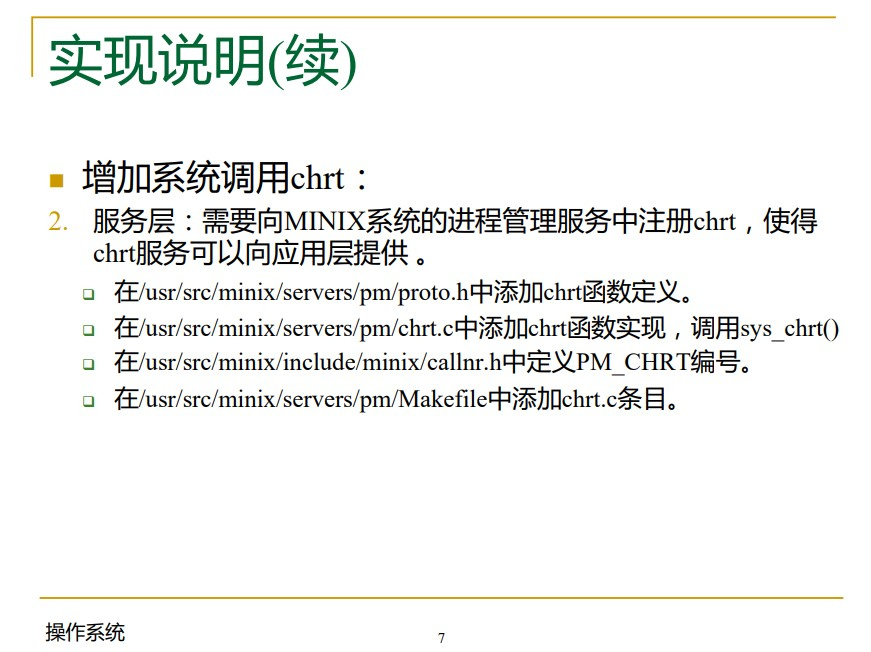

在/usr/src/minix/servers/pm/proto.h中添加chrt函数定义:

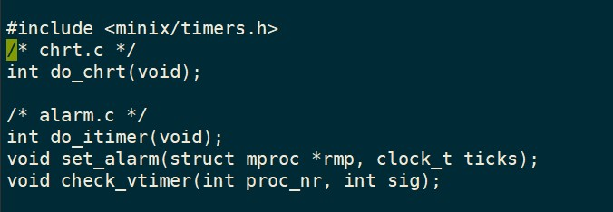

在/usr/src/minix/include/minix/callnr.h中定义PM_CHRT编号

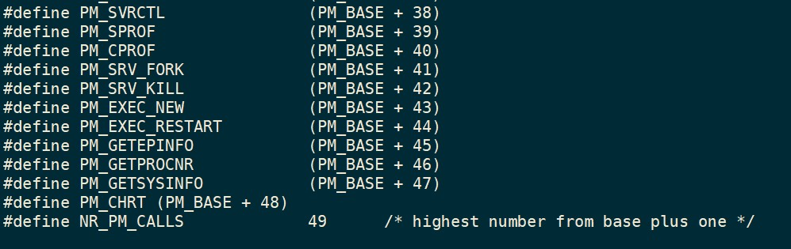

在/usr/src/minix/servers/pm/Makefile中添加chrt.c条目

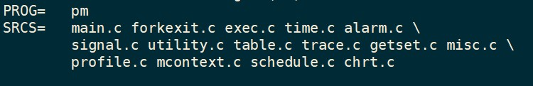


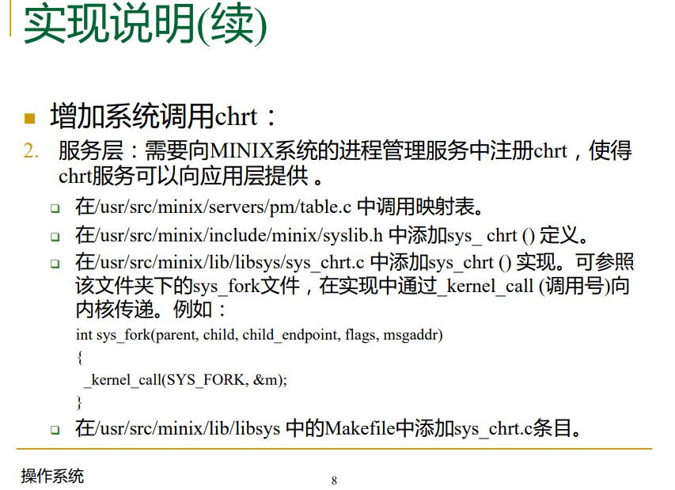

在/usr/src/minix/servers/pm/table.c 中调用映射表:

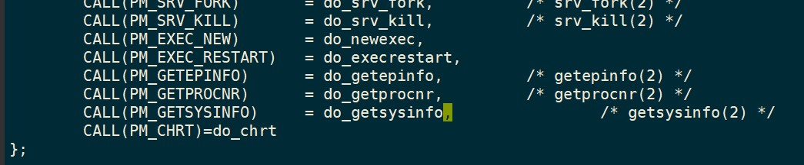

注意这里的逗号不能忽略。

在/usr/src/minix/include/minix/syslib.h 中添加sys_ chrt () 定义:

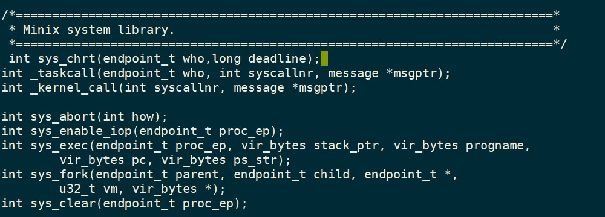

在/usr/src/minix/lib/libsys 中的Makefile中添加sys_chrt.c条目

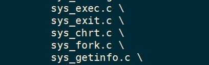

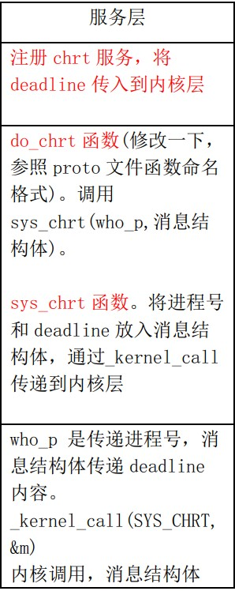

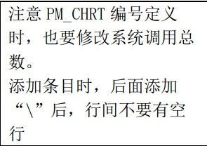

#### 4.2.2实现chrt()

在/usr/src/minix/servers/pm/chrt.c中添加chrt函数实现，要调用sys_chrt()

这个函数的功能是消息接收，我们只需要将发来消息的进程号和发来的消息传递给服务层并向内核进行消息传递即可：

由于在应用层时我们把deadline放到了m2_l1中，因此这里也要从m2_l1取值；为何最后return OK?因为我参考了一下这个目录下的其他源代码，发现都是如此。

```c
#include "pm.h"
#include <sys/wait.h>
#include <assert.h>
#include <minix/callnr.h>

#include <minix/com.h>
#include <minix/sched.h>
#include <minix/vm.h>
#include <sys/ptrace.h>
#include <sys/resource.h>
#include <signal.h>
#include <stdio.h>
#include "mproc.h"

int do_chrt(){
    sys_chrt(who_p, m_in.m2_l1);
    return OK;
}
```

#### 4.2.3实现sys_chrt()

在/usr/src/minix/lib/libsys/sys_chrt.c 中添加sys_chrt () 实现。

这个函数也是很容易实现的，我只需要将传入的函数重新打包为一个新的消息，并通过_kernel_call将其传入内核层即可：

```c
#include "syslib.h"

int sys_chrt(endpoint_t who,long deadline){
  message m;
  m.m2_i1 = who;
  m.m2_l1 = deadline;
  return _kernel_call(SYS_CHRT, &m);
}
```

### 4.3内核层

#### 4.3.1准备工作

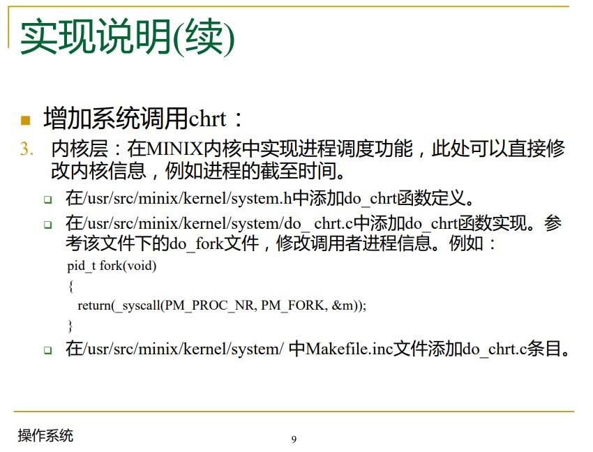

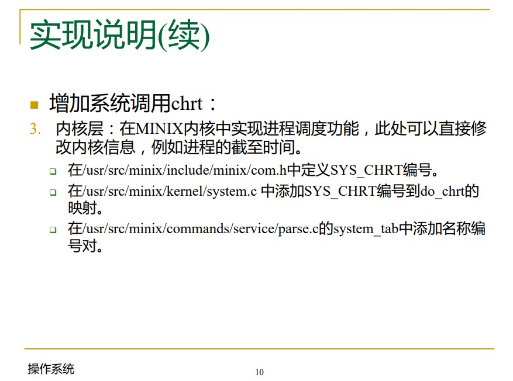

在/usr/src/minix/kernel/system.h中添加do_chrt函数定义

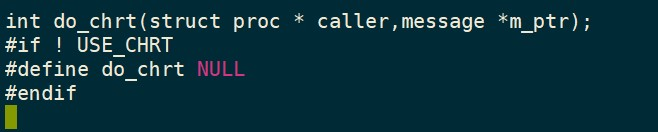

在/usr/src/minix/kernel/system/ 中Makefile.inc文件添加do_chrt.c条目

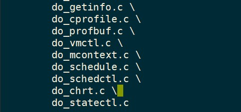

在/usr/src/minix/include/minix/com.h中定义SYS_CHRT编号

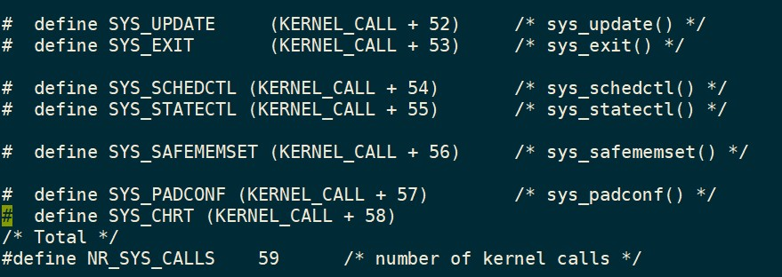

在/usr/src/minix/commands/service/parse.c的system_tab中添加名称编号对

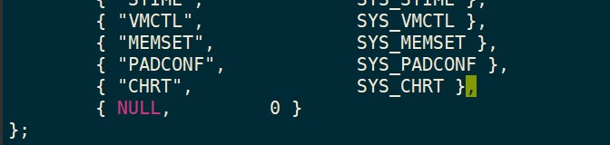

在/usr/src/minix/kernel/system.c 中添加SYS_CHRT编号到do_chrt的映射.

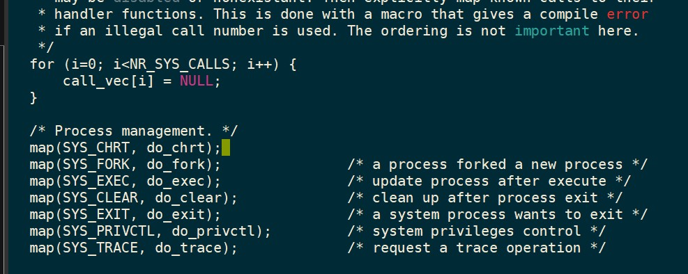

在/usr/src/minix/kernel/config.h 中添加 USE_CHRT 宏定义

这个十分重要，如果没有，程序就根本不会正常运行。

```c
#define USE_CHRT 1
```

#### 4.3.2实现do_chrt()

内核的任务就是把上层传递下来的消息解析出来，并将目标进程的截止时间设置为用户所指定的时间。在上述准备的基础上，我只用在/usr/src/minix/kernel/system/do_chrt.c中添加do_chrt函数实现就行了。在参考了该文件夹下的do_fork()文件后，我完成了相应的代码:

```c
#include "kernel/system.h"
#include <stdio.h>
#include <unistd.h>
#include <sys/types.h>
#include <lib.h>
#include <minix/endpoint.h>
#include <minix/u64.h>

#if USE_CHRT
int do_chrt(struct proc *caller, message *m_ptr){
  struct proc *rp;
  rp = proc_addr(m_ptr->m2_i1);//get the process
  rp->p_deadline =m_ptr->m2_l1;//set the deadline
  return OK;
}
#endif
```

至此，我在三个需要用到的层面的修改完成了。剩下的才是本实验的重头戏，就是实现EDF调度算法了。

###  4.4进程调度EDF

#### 4.4.0基础知识

MINIX 3 中的进程调度器使用一个多级排队系统，维护了 16 个可运行进程队列，通过赋予不同的队列不同的优先级来实现进程分级。最高优先级队列（0号队列）存放的是系统和时钟这样的底层任务，7 号队列用于放置用户进程。

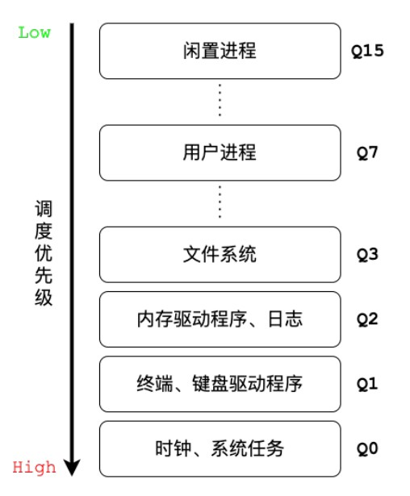

每个队列内部采用时间片轮转调度，找到最高非空优先级队列，选取队列首部可运行的进程， 当用完了时间片，则移到当前队列的队尾。

在本次实验中，我们需要将调用chrt的进程设置为实时进程，这就意味着调用chrt之后进程的优先级要比7号队列:用户进程要高；同时，为了不妨碍操作系统的运行，所以这个进程的优先级不能比3号队列:文件系统大——因此，我们可以选择4,5,6号队列，在这里我选择了5号队列。

那么什么是EDF算法呢？我在上网查阅资料后，终于有了一个完整的认识。

EDF算法根据任务的截止时间来确定任务的优先级。截止时间越早，其优先级越高。该算法要求在系统中保持一个实时任务就绪队列，该队列按各任务截止时间的早晚排序，调度程序在选择任务时总是选择就绪队列中的第一个任务，为之分配处理机，使之投入运行。EDF算法既可以用于抢占式调度，也可用于非抢占式调度。
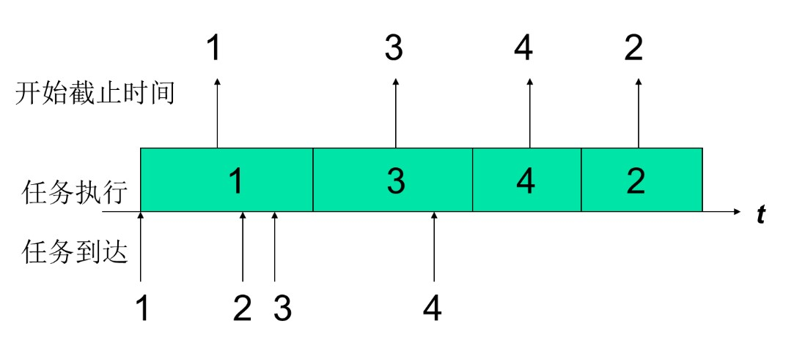

任务 1 最先到达最先开始执行

任务 1 执行过程中任务 2、任务 3 到达，由于任务 3 截止时间更早，其优先级愈 高，所以执行完任务 1 后执行任务 3 

任务 3 执行过程中任务 4 到达，由于任务 4 截止时间更早优先级愈高，任务3 执行完后执行任务 4, 最后执行任务2

非抢占式调度

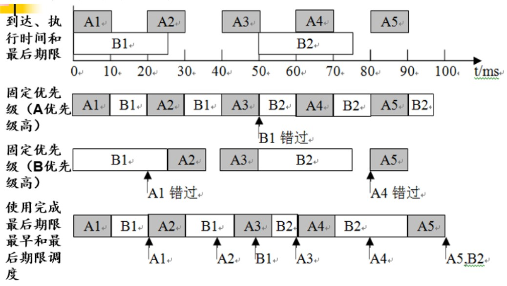

抢占式调度

有两个周期性任务，任务A的周期时间为20ms，每个周期的处理时间为10ms；任务B的周期时间为50ms，每个周期的处理时间为25ms

在t=0时，A1和B1同时到达A1的开始截止时间为10，B1为25，所以A1执行，当A1执行完后，只有B1了，所以让B1执行10，然后A2到达，此时B1开始截止时间为35，A2为30，所以A2执行10，然后只有B1了，所以让B1继续执行10，此时A3到达，A3开始截止时间为50，B1为45，所以B1继续执行5（B1全部执行完），后只有A3了，所以让A3执行5，此时B2到了，但是B2开始截止时间为75，A3为55，所以A3继续执行5，然后只剩下了B2，所以让B2执行5，此时A4又到了，A4的开始截止时间为70，B2为80，所以A4执行10，然后又是只有B2了，所以B2执行执行10，然后A5到了，A5的开始截止时间为90，B2的也是90，为了符合实际和节省资源，所以让B2继续执行10，然后A5执行10。


#### 4.4.1修改进程调度模块

为了记录进程的终止时间，由于传统的PCB是没有的，所以需要在PCB中对进程结构体加一个p_deadline变量。

在 /usr/src/minix/kernel/proc.h中为proc结构体添加p_deadline:

```c
long p_deadline;  
```

接着就是在proc.c中对应的入队enqueue(按优先级将进程加入列队尾)和enqueue_head(按优先级将进程加入列队首)操作中加入默认进入5号队列的:

```c
   if (rp->p_deadline > 0)rp->p_priority = 5; 
```

为什么这样判定呢？在进程初始化时p_deadline是0的，如果它大于0，说明这是一个调用chrt的进程。

最后就是修改proc.c文件的pick_proc方法，将EDF的运行逻辑加入其中:

```c
  for (q=0; q < NR_SCHED_QUEUES; q++) {	
	if(!(rp = rdy_head[q])) {
		TRACE(VF_PICKPROC, printf("cpu %d queue %d empty\n", cpuid, q););
		continue;
	}
  
if(q==5){
    rp=rdy_head[q];
    struct proc *cur = rp->p_nextready; 
    while(cur!=NULL) {
        if(proc_is_runnable(cur) && (cur->p_deadline > 0)) {
            if (rp->p_deadline > cur->p_deadline)rp = cur;
            else if (rp->p_deadline == 0)rp = cur;
        }
        cur = cur->p_nextready;
    }
}


	assert(proc_is_runnable(rp));
	if (priv(rp)->s_flags & BILLABLE)	 	
		get_cpulocal_var(bill_ptr) = rp; /* bill for system time */
	return rp;
  }
```

## 5.总结

test代码如下所示:

```c
#include <stdio.h>
#include <stdlib.h>
#include <unistd.h>
#include <string.h>
#include <signal.h>
#include <sys/wait.h>
#include <sys/types.h>
#include <lib.h>
#include <time.h>

void proc(int id);

int main(void)
{
  //创建三个子进程，并赋予子进程id
  for (int i = 1; i < 4; i++)
  {
    if (fork() == 0)
    {
      proc(i);
    }
  }
  for (int i = 1; i < 4; i++)
    waitpid(-1, NULL, 0);
  return 0;
}

void proc(int id)
{
  int loop;
  switch (id)
  {
  case 1: //子进程1，设置deadline=25
    chrt(25);
    printf("proc1 set success\n");
    sleep(1);
    break;
  case 2: //子进程2，设置deadline=15
    chrt(15);
    printf("proc2 set success\n");
    sleep(1);
    break;
  case 3: //子进程3，普通进程
    chrt(0);
    printf("proc3 set success\n");
    sleep(1);
    break;
  }
  for (loop = 1; loop < 40; loop++)
  {
    //子进程1在5s后设置deadline=5
    if (id == 1 && loop == 5)
    {
      chrt(5);
      printf("Change proc1 deadline to 5s\n");
    }
    //子进程3在10s后设置deadline=3
    if (id == 3 && loop == 10)
    {
      chrt(3);
      printf("Change proc3 deadline to 3s\n");
    }
    sleep(1); //睡眠，否则会打印很多信息
    printf("prc%d heart beat %d\n", id, loop);
  }
  exit(0);
}
```

在测试样例中，在main函数中fork三个子进程(P1, P2, P3)，并为每个子进程设置id。 P1和P2为实时进程，deadline分别设为25s和15s。 三个子进程会打印出子进程id和循环次数。 

第0s时：优先级 P2 > P1 > P3; 

第5s 时：P1设置deadline为5s，P1调用chrt(5); 

第5s后：优先级 P1 > P2 > P3;

 第10s时：P3设置deadline为3s，P3调用chrt(3); 

第10s后：优先级P3 > P2;

这里有一个需要注意的点就是我们需要在 case 3的 printf后添加一行 sleep(1)来让测试正常，否则，3号进程永远会先于1,2号进程 1秒运行。在更改后，运行正常了，结果如下所示:

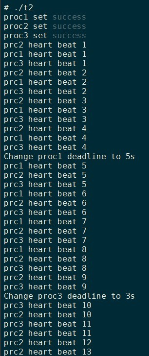

通过本次实验，我通过修改 Minix3 的系统源码，实现了一个较为完整的系统调用，并在进程调度过程中实现了 EDF 算法。这些努力大大加深了我对一个微内核操作系统的系统调用、消息传递及进程调度机制的理解，为之后的学习打下了坚实的基础。
