# <center>华东师范大学数据科学与工程学院实验报告</center>

|课程名称:操作系统 | 年级:22级 | 上机实践成绩: |
| ---- | ---- | ---- |
| 指导教师:翁楚良 | 姓名:郭夏辉 | 学号:10211900416 |
| 上机实践名称:I/O 子系统 | 上机实践日期:2023年4月27日 | 上机实践编号:No.03 |
| 组号:1-416 | 上机实践时间:2023年4月27日 |      |


## 1.目标

1.熟悉类UNIX系统的I/O设备管理

2.熟悉MINIX块设备驱动

3.熟悉MINIX RAM盘

## 2.实验要求

1.在MINIX3中安装一块X MB大小的RAM盘（minix中已有6块用户可用RAM盘，7块系统保留RAM盘），可以挂载并且存取文件操作。

2.测试RAM盘和DISK盘的文件读写速度，分析其读写速度差异原因（可用图表形式体现在实验报告中）。

## 3.实验环境

编辑与开发:Visual Studio Code 

虚拟机系统:MINIX 3.3 

物理机系统:Windows 10 专业版 19042.1110 

虚拟机程序:VMware Workstation 16 Pro 

连接虚拟机:MobaXterm Professional v20.0

## 4.实验过程

### 4.1新增RAM盘

首先，需要修改/usr/src/minix/drivers/storage/memory/memory.c  增加默认的用户 RAM盘数，将原有的6块用户可用的RAM盘修改为7块

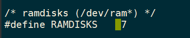

然后就是增量式重新编译内核:`make build MKUPDATE=yes`,接着重启

重启之后来测试一下我们的myram是否能成功创建:

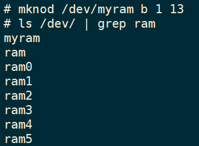

在这之后我们要实现buildmyram工具，这个是以一个命令的形式呈现的，我们要在相应的文件中去定义它，然后在特定的目录中补全它的实现。参考ramdisk的实现之后，我们能较为轻易地补全buildmyram的功能。

创建并修改`buildmyram.c` ,这个源代码我放在`/usr/src/minix/commands/ramdisk/`,但是编译后的程序放在了/root/

在ramdisk.c的基础上，我们需要将KB单位修改为MB

```c
#include <minix/paths.h>
#include <sys/ioc_memory.h>
#include <stdio.h>
#include <fcntl.h>
#include <stdlib.h>

int main(int argc, char* argv[]) {
    int fd;
    signed long size;
    char* d;

    if (argc < 2 || argc > 3) {
        fprintf(stderr, "usage: %s <size in MB> [device]\n",argv[0]);
        return 1;
    }

    d = argc == 2 ? _PATH_RAMDISK : argv[2];
    if ((fd = open(d, O_RDONLY)) < 0) {
        perror(d);
        return 1;
    }

#define MFACTOR 1048576
    size = atol(argv[1]) * MFACTOR;

    if (size < 0) {
        fprintf(stderr, "size should be non-negative.\n");
        return 1;
    }

    if (ioctl(fd, MIOCRAMSIZE, &size) < 0) {
        perror("MIOCRAMSIZE");
        return 1;
    }

    fprintf(stderr, "size on %s set to %ldMB\n", d, size / MFACTOR);

    return 0;
}
```

然后编译并运行buildmyram:`./buildmyram 512 /dev/myram`:

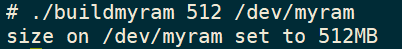

在我新建的内存盘上创建内存文件系统`mkfs.mfs /dev/myram`

这里为了方便操作，我在/root下新建了一个myram目录便于之后的挂载。

然后就是将ram盘挂载到这个/root/myram:

`mount /dev/myram /root/myram`

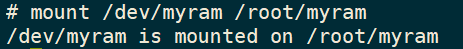

df一下，可以看到新建的ram盘已经成功挂载了:

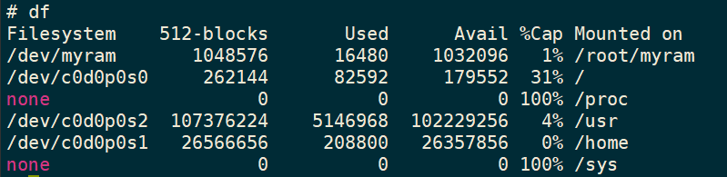

还有个问题需要注意，就是每次重启都要重新设置RAM的大小并挂载，即从buildmyram到mkfs.mfs再到mount都需要再走一遍。

### 4.2相关的性能测试

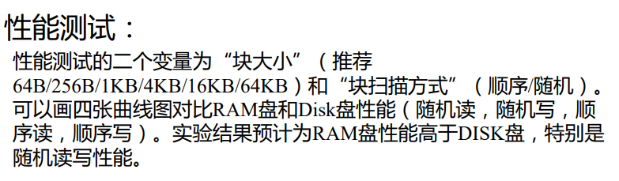

#### 4.2.1读写文件

为什么还要专门地给相应的读写文件写一下对应的方法呢？因为我们要多次重复地读写来测试相应介质的速率。

在完成相应的功能时，有几个需要注意的点:

1. 要检查read,write,open等函数的返回值，不能假定地认为它们是没问题的，否则就会出现比较奇怪的情况。
2. 随机读写时，可以采用lseek重新定位文件指针；顺序读写时，默认文件指针自动移动，当读到文件末尾时，可以用lseek返回文件头。
3. 每组的读写需要反复持续一段时间，过短的时间会造成误差较大。我设定了一个迭代的次数，在这个迭代的次数下一直进行读写。
4. 为了简化实验，可以为每个进程分配一个独立的文件。为了减小主机操作系统的缓存机制造成的误差，文件总大小越大越好（例如300MB）。这里我可以认为这个分配的独立文件是一个大块，而去读写时用的是各个小块。

然后我会按顺序来介绍一下自己代码的实现思路:

首先，我们要怎样打开文件，结合第一次实验的内容我，我们显然要利用open函数，然后选择特定的方式。O_RDWR以可读写方式打开文件;O_SYNC以同步的方式打开文件，这样read和write操作也可以是同步模式了;O_CREAT表示如果打开的文件不存在则自动建立新文件。

然后就是权限设定，我采用的是0755，这个的含义给予了文件用户充分的权限。

```c
    int fd = open(filepath,O_RDWR|O_SYNC|O_CREAT,0755);
    if (fd == -1) {
        fprintf(stderr, "FILE OPEN ERROR\n");
        return;
    }
```

有个需要注意的就是判断open的返回值。

还有个问题，就是对于随机读写的情况，应该怎么办呢？

对于写文件，我们是在一整个大块中去一个一个小块地写入了，这就意味着我们只要不超过这个大块就行:

```c
        if(isrand){
            lseek(fd,rand() % (MAX_FILESIZE-blocksize),SEEK_SET);
        }
```

为什么最后还要减一下呢？因为我们写了blocksize(小块)的数据，当然要保证写的这一堆不能溢出。

对于读文件，我们每次读取的只是一小部分，采用一个类似于分层抽样的方法，可以采用如下方式确保每次读取的不一样。

```c
        if (isrand) {
            lseek(fd,(MAXITER-1)*(rand() % blocksize),SEEK_SET);
        }
```

还有就是迭代次数，我这里选择迭代1000次，这样可以显著化数据方便分析。

完整的程序如下所示:

```c
void read_file(int blocksize, int isrand, char* filepath){
    int fd = open(filepath,O_RDWR|O_SYNC|O_CREAT,0755);
    if (fd == -1) {
        fprintf(stderr, "FILE OPEN ERROR\n");
        return;
    }
    for (int i=0;i<MAXITER;i++) {
        if (read(fd,buff,blocksize) != blocksize) {
            fprintf(stderr, "FILE READ ERROR\n");
            return;
        }
        if (isrand) {
            lseek(fd,(MAXITER-1)*(rand() % blocksize),SEEK_SET);
        }
    }
    lseek(fd, 0, SEEK_SET);
}

void write_file(int blocksize, int isrand, char* filepath) {
    int fd = open(filepath,O_RDWR|O_SYNC|O_CREAT,0755);
    if (fd == -1){
        fprintf(stderr, "FILE OPEN ERROR\n");
        return;
    }
    for (int i=0;i<MAXITER;i++) {
        if(write(fd,text,blocksize)!= blocksize){
            fprintf(stderr,"FILE WRITE ERROR\n");
            return;
        }
        if(isrand){
            lseek(fd,rand() % (MAX_FILESIZE-blocksize),SEEK_SET);
        }
    }
    lseek(fd, 0, SEEK_SET);
}
```

#### 4.2.2计算时间

在实际的实验过程中，我单纯地使用日常使用的clock()去计算时间差总是得到$0s$，然后我想到了第二次实验过程中用到的timespec结构体。在这个结构体中，`tv_sec`成员表示的是秒，而`tv_nsec`表示的竟然到了纳秒级的精度，这个还是很好的。然后我写出了相应的计算时间差的代码，经过测试，原先的问题得到了解决:

```c
double calc_time(struct timeval t1, struct timeval t2) {
    return (double)(t2.tv_sec - t1.tv_sec)*1000+(t2.tv_usec-t1.tv_usec)/1000;
}
```

注意这个函数得到的时间差值是毫秒级的，在实验的计算环节用的却是秒级的数据，最后一定不能忘了处理。

然后获取时间时只需要用`gettimeofday`方法即可。

#### 4.2.3主程序

不管是RAM还是磁盘，在MINIX中都是以文件形式存在的。针对每个进程，我采用文件的形式来存储它们，但是文件名的标识要预先处理一下。

```c
char RAMpath[32][64],DISKpath[32][64];
char rambase[] ="/root/myram/test",diskbase[]="/usr/test",endtmp[]=".txt";
void Solve_Filename(){
    char test[20][3]={"0","1","2","3","4","5","6","7","8",
    "9","10","11","12","13","14","15","16"};
    for(int i=1;i<=16;i++){
        strcpy(RAMpath[i],rambase);
        strcat(RAMpath[i],test[i]);
        strcat(RAMpath[i],endtmp);
        strcpy(DISKpath[i],diskbase);
        strcat(DISKpath[i],test[i]);
        strcat(DISKpath[i],endtmp);
    }
    return;
}
```

对于选定的存储介质(磁盘或者RAM),我们有四种需要测试的情况:顺序读取，顺序写入，随机读取，随机写入。我们只要在主函数中合理地包装各个测试点就行。

一切开始之前我还把写缓冲区通过拼接的方式构造了出来:

```c
for (int i=0;i<MAXWRITEBUF;i+=26)strcat(write_buff,"abcdefghijklmnopqrstuvwxyz");
```

注意这个在测试过程中需要采用多进程并发的同步读写，为了尽可能达到饱和，使得总吞吐量较大，我选择了并发数8来测试,这样也比较安全。这里要注意父子进程的关系，在子进程还没有结束时，父进程我选择了忙等待，直到子进程结束了再开启新的循环。

还有就是最后计算吞吐量时，别忘了要把每一个子进程的每一次迭代都算进去，这个还是很细节的。

我的主函数长这个样子:

```c
int main(int argc, char* argv[]){
    srand((unsigned)time(NULL));

    Solve_Filename();

    double Time;
    struct timeval t1,t2;

    for (int i=0;i<MAXWRITEBUF;i+=26)strcat(write_buff,"abcdefghijklmnopqrstuvwxyz");
    printf("BlockSize(KB),Speed(MB/s)\n");

    for(int blocksize=64;blocksize<=64*1024;blocksize*=2){
        gettimeofday(&t1,NULL);
        for(int i=0;i<CONCURRENT;i++){
            if(fork()==0){
                if(!strcmp(argv[1],"W")){
                    //写
                    if(!strcmp(argv[2],"R")){
                        //随机
                        if(!strcmp(argv[3],"R")){
                            //ram盘
                            write_file(blocksize,1,RAMpath[i]);
                        }else{
                            //磁盘
                            write_file(blocksize,1,DISKpath[i]);
                        }
                    }else{
                        //顺序
                        if(!strcmp(argv[3],"R")){
                            //ram盘
                            write_file(blocksize,0,RAMpath[i]);
                        }else{
                            //磁盘
                            write_file(blocksize,0,DISKpath[i]);
                        }
                    }
                }else{
                    //读
                    if(!strcmp(argv[2],"R")){
                        //随机
                        if(!strcmp(argv[3],"R")){
                            //ram盘
                            read_file(blocksize,1,RAMpath[i]);
                        }else{
                            //磁盘
                            read_file(blocksize,1,DISKpath[i]);
                        }
                    }else{
                        //顺序
                        if(!strcmp(argv[3],"R")){
                            //ram盘
                            read_file(blocksize,0,RAMpath[i]);
                        }else{
                            //磁盘
                            read_file(blocksize,0,DISKpath[i]);
                        }
                    }
                }
                exit(0);
            }
        }
        while(wait(NULL)!=-1);
        gettimeofday(&t2,NULL);
        Time=calc_time(t1,t2)/1000.0;
        int sumsize=CONCURRENT*MAXITER*blocksize;
        printf("%lf,%lf\n",((double)blocksize)/1024,((double)sumsize/Time/1024/1024));
    }
    return 0;
}

```

#### 4.2.4测试脚本

因为这次实验过程中有大量的重复操作，为了让程序变得简略，也为了简化自己的操作，我想到了利用管道将相关的数据传出来，这个过程我选择使用shell脚本来进行。（自己就不用一个一个数据输入了）

这个脚本执行的操作之先后顺序也小有讲究，就是在相同的情况下，先写后读(要不然读什么？)在读结束之后，要删除相关的测试文件，要不然会影响其他的测试点。

在脚本写好后，应该`chmod u+x run.sh`来赋予用户执行的权限。

```shell
clang test.c -o test

./test W R R 
echo GET RAMrandWRITE
./test R R R 
echo GET RAMrandREAD
rm /root/myram/*.txt


./test W R D
echo GET DISKrandWRITE
./test R R D
echo GET DISKrandREAD
rm /usr/*.txt

./test W O R 
echo GET RAMorderWRITE
./test R O R
echo GET RAMorderREAD
rm /root/myram/*.txt

./test W O D
echo GET DISKorderWRITE
./test R O D 
echo GET DISKorderREAD
rm /usr/*.txt
```

#### 4.2.5结果与分析

在运行后，我得到了相应的运行结果:

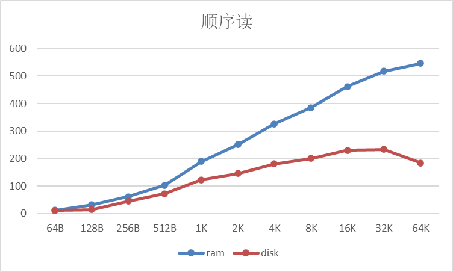

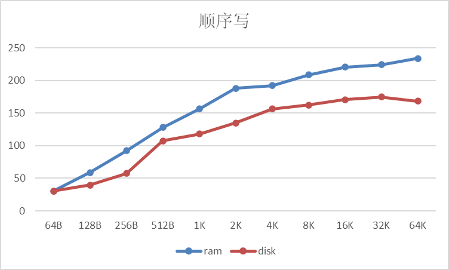

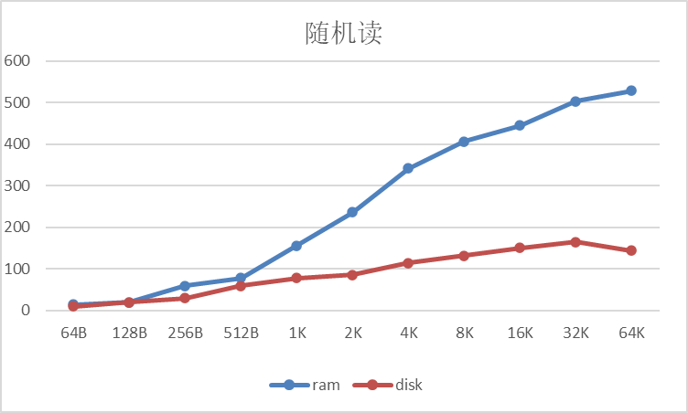

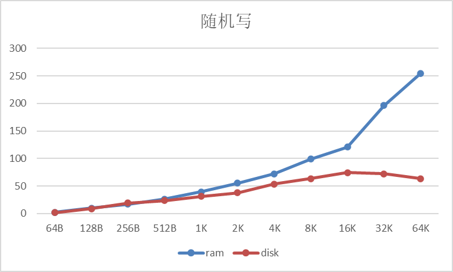

这四张图很有意思，我结合观察来谈一下自己的理解:

1. 四种情况下disk在blocksize增大到一定程度之后都出现了吞吐量下降的情况。结合上学期学习计算机系统的“存储器山”，我认为这是因为块大小过大时，超出了磁盘的缓冲区，这样程序的时间局部性很差，吞吐量反而减小了。
2. 先分析读操作。如果是顺序读，disk可以按照利用空间局部性，按顺序将数据读入到缓冲区中，这样做可以尽量缩小和ram盘的吞吐量差距，但是在实际如图所示，两者的差距反而在略微地增大，我猜测这主要还是因为硬件原因——disk的缓存速率较慢。如果是随机读，disk每次都需要进行漫长的寻道操作，而且还不能使用自身的缓存来提高速度。然后，我们可以看到随机读情况下ram和disk的吞吐量对比相较于顺序读情况时更加悬殊。
3. 再分析写操作。如果是顺序写，disk可以利用缓存来优化了，并不用每次都重新寻道，在这样的情况下从前往后去写，disk与ram之间的吞吐量虽然有略微的差异，但是差距并不是很明显，基本走势还是类似的。如果是随机写，disk每次都要重新寻道，而且还无法借助缓存的优化，可以看到ram在这样的情况下与disk之间的吞吐量差距越来越大。
4. 无论是disk还是ram,无论是读还是写,在随机情况下吞吐量一般都比顺序情况下低。ram可能并不是很明显，disk却很显著；读操作时可能差异不算大，写操作时差异相对来说较大。还有个有趣的现象是当块大小较小时，顺序读写的吞吐量明显大于随机读写；当块大小较大时，两者差距较小。
5. ram盘的吞吐量各种情况下一般是高于disk的，深究其原因，还在于它们原理的不同——前者没有寻道和旋转延迟，而后者有，这深刻地影响了吞吐量。

### 4.3(额外)对吞吐量和并发量的探究

虽然助教说了这个任务可以不用做，但是本着好奇的态度，我还是打算完成一下这个task.

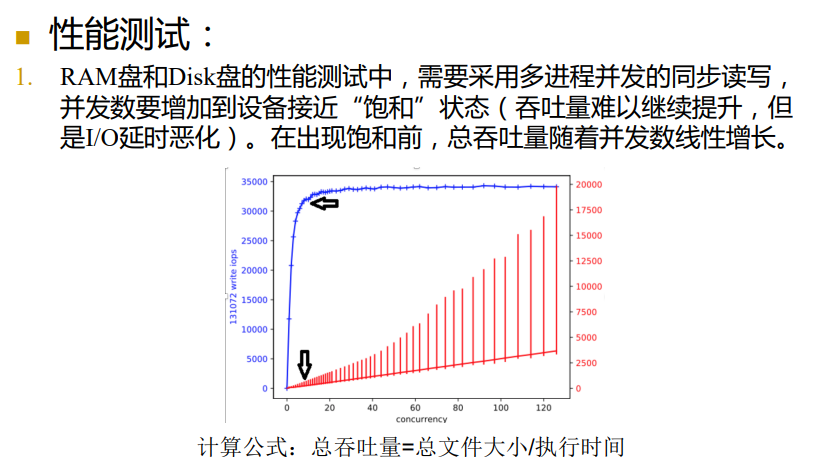

其实就是结合那个性能测试的代码加以修改一下，然后依照块大小8KB，顺序写入的情况去看一下各个并发数情况下的吞吐量就行。

```c
#include<stdio.h>
#include<stdlib.h>
#include<string.h>
#include<unistd.h>
#include<sys/types.h>
#include<sys/stat.h>
#include<sys/wait.h>
#include<fcntl.h>
#include<time.h>
#include<string.h>
#include<errno.h>
#define MAXITER 1000
#define MAXWRITEBUF (1024*1024)  //写缓冲最大容量
#define MAX_FILESIZE (300*1024*1024) //大块 300MB最大
#define Blocksize (8*1024)

char write_buff[MAXWRITEBUF];
char RAMpath[100][64];
char rambase[] ="/root/myram/test",endtmp[]=".txt";

void write_file(int blocksize, int isrand, char* filepath) {
    int fd = open(filepath,O_RDWR|O_SYNC|O_CREAT,0755);
    if (fd == -1){
        fprintf(stderr, "FILE OPEN ERROR\n");
        return;
    }
    for (int i=0;i<MAXITER;i++) {
        if(write(fd,write_buff,blocksize)!= blocksize){
            fprintf(stderr,"FILE WRITE ERROR\n");
            return;
        }
        if(isrand){
            lseek(fd,rand() % (MAX_FILESIZE-blocksize),SEEK_SET);
        }
    }
    lseek(fd, 0, SEEK_SET);
}

double calc_time(struct timeval t1, struct timeval t2) {
    return (double)(t2.tv_sec - t1.tv_sec)*1000+(t2.tv_usec-t1.tv_usec)/1000;
}

void Solve_Filename(){
    char test[120][4]={"1","2","3","4","5","6","7","8","9","10",
        "11","12","13","14","15","16","17","18","19","20",
        "21","22","23","24","25","26","27","28","29","30",
        "31","32","33","34","35","36","37","38","39","40",
        "41","42","43","44","45","46","47","48","49","50",
        "51","52","53","54","55","56","57","58","59","60",
        "61","62","63","64","65","66","67","68","69","70",
        "71","72","73","74","75","76","77","78","79","80",
        "81","82","83","84","85","86","87","88","89","90",
        "91","92","93","94","95","96","97","98","99"};
    for(int i=1;i<=99;i++){
        strcpy(RAMpath[i],rambase);
        strcat(RAMpath[i],test[i]);
        strcat(RAMpath[i],endtmp);
    }
    return;
}

int main(){
    srand((unsigned)time(NULL));

    Solve_Filename();

    double Time;
    struct timeval t1,t2;

    for (int i=0;i<MAXWRITEBUF;i+=26)strcat(write_buff,"abcdefghijklmnopqrstuvwxyz");
    struct timeval t1,t2;
    double Time;
    for (int num=1;num<=80;num++) {
        gettimeofday(&t1, NULL);
        for (int i=0;i<num;i++) {
            int pid=fork();
            if (pid==0) {
                write_file(Blocksize,0,RAMpath[i]);
                exit(0);
            }
        }
        while (wait(NULL)!=-1);
        gettimeofday(&t2,NULL);
        Time=calc_time(t1,t2)/1000.0;
        int sumsize=num*MAXITER*Blocksize;
        printf("%d,%lf,%lf\n",num,((double)sumsize/Time/1024.0/1024.0),Time);
    }
    return 0;
}
```

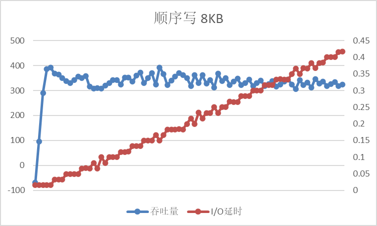

可以看到与预计的相符，在并发数7-15的时候吞吐量达到了饱和。

### 4.4附录

#### 4.4.1相关的性能测试之完整代码

```c
#include<stdio.h>
#include<stdlib.h>
#include<string.h>
#include<unistd.h>
#include<sys/types.h>
#include<sys/stat.h>
#include<sys/wait.h>
#include<fcntl.h>
#include<time.h>
#include<string.h>
#include<errno.h>
#define MAXITER 1000
#define MAXWRITEBUF (1024*1024)  //写缓冲最大容量
#define MAXREADBUF (1024*1024) //读缓冲最大容量
#define MAX_FILESIZE (300*1024*1024) //大块 300MB最大
#define CONCURRENT 8 //并发数

char RAMpath[32][64],DISKpath[32][64];
char rambase[] ="/root/myram/test",diskbase[]="/usr/test",endtmp[]=".txt";
char write_buff[MAXWRITEBUF];
char read_buff[MAXREADBUF];

void read_file(int blocksize, int isrand, char* filepath){
    int fd = open(filepath,O_RDWR|O_SYNC|O_CREAT,0755);
    if (fd == -1) {
        fprintf(stderr, "FILE OPEN ERROR\n");
        return;
    }
    for (int i=0;i<MAXITER;i++) {
        if (read(fd,read_buff,blocksize) != blocksize) {
            fprintf(stderr, "FILE READ ERROR\n");
            return;
        }
        if (isrand) {
            lseek(fd,(MAXITER-1)*(rand() % blocksize),SEEK_SET);
        }
    }
    lseek(fd, 0, SEEK_SET);
}

void write_file(int blocksize, int isrand, char* filepath) {
    int fd = open(filepath,O_RDWR|O_SYNC|O_CREAT,0755);
    if (fd == -1){
        fprintf(stderr, "FILE OPEN ERROR\n");
        return;
    }
    for (int i=0;i<MAXITER;i++) {
        if(write(fd,write_buff,blocksize)!= blocksize){
            fprintf(stderr,"FILE WRITE ERROR\n");
            return;
        }
        if(isrand){
            lseek(fd,rand() % (MAX_FILESIZE-blocksize),SEEK_SET);
        }
    }
    lseek(fd, 0, SEEK_SET);
}

void Solve_Filename(){
    char test[20][3]={"0","1","2","3","4","5","6","7","8",
    "9","10","11","12","13","14","15","16"};
    for(int i=1;i<=16;i++){
        strcpy(RAMpath[i],rambase);
        strcat(RAMpath[i],test[i]);
        strcat(RAMpath[i],endtmp);
        strcpy(DISKpath[i],diskbase);
        strcat(DISKpath[i],test[i]);
        strcat(DISKpath[i],endtmp);
    }
    return;
}

double calc_time(struct timeval t1, struct timeval t2) {
    return (double)(t2.tv_sec - t1.tv_sec)*1000+(t2.tv_usec-t1.tv_usec)/1000;
}

int main(int argc, char* argv[]){
    srand((unsigned)time(NULL));

    Solve_Filename();

    double Time;
    struct timeval t1,t2;

    for (int i=0;i<MAXWRITEBUF;i+=26)strcat(write_buff,"abcdefghijklmnopqrstuvwxyz");
    printf("BlockSize(KB),Speed(MB/s)\n");

    for(int blocksize=64;blocksize<=64*1024;blocksize*=2){
        gettimeofday(&t1,NULL);
        for(int i=0;i<CONCURRENT;i++){
            if(fork()==0){
                if(!strcmp(argv[1],"W")){
                    //写
                    if(!strcmp(argv[2],"R")){
                        //随机
                        if(!strcmp(argv[3],"R")){
                            //ram盘
                            write_file(blocksize,1,RAMpath[i]);
                        }else{
                            //磁盘
                            write_file(blocksize,1,DISKpath[i]);
                        }
                    }else{
                        //顺序
                        if(!strcmp(argv[3],"R")){
                            //ram盘
                            write_file(blocksize,0,RAMpath[i]);
                        }else{
                            //磁盘
                            write_file(blocksize,0,DISKpath[i]);
                        }
                    }
                }else{
                    //读
                    if(!strcmp(argv[2],"R")){
                        //随机
                        if(!strcmp(argv[3],"R")){
                            //ram盘
                            read_file(blocksize,1,RAMpath[i]);
                        }else{
                            //磁盘
                            read_file(blocksize,1,DISKpath[i]);
                        }
                    }else{
                        //顺序
                        if(!strcmp(argv[3],"R")){
                            //ram盘
                            read_file(blocksize,0,RAMpath[i]);
                        }else{
                            //磁盘
                            read_file(blocksize,0,DISKpath[i]);
                        }
                    }
                }
                exit(0);
            }
        }
        while(wait(NULL)!=-1);
        gettimeofday(&t2,NULL);
        Time=calc_time(t1,t2)/1000.0;
        int sumsize=CONCURRENT*MAXITER*blocksize;
        printf("%lf,%lf\n",((double)blocksize)/1024,((double)sumsize/Time/1024.0/1024));
    }
    return 0;
}

```

## 5.总结

在本次实验中，我在 Minix3 中划分了一块新RAM 盘，并通过 一系列的测试更加直观地认识到了disk和ram盘之间的差异性，也对操作系统io相关的知识有了更深刻的理解。结合上学期在计算机系统中所学的知识，我意识到只有把握底层的原理，操作系统所提供的功能才能更好地解决我们的需求。

