# <center>华东师范大学数据科学与工程学院实验报告</center>

|课程名称:操作系统 | 年级:22级 | 上机实践成绩: |
| ---- | ---- | ---- |
| 指导教师:翁楚良 | 姓名:郭夏辉 | 学号:10211900416 |
| 上机实践名称:内存管理 | 上机实践日期:2023年5月25日 | 上机实践编号:No.04 |
| 组号:1-416 | 上机实践时间:2023年5月25日 |      |

## 1.目标

1.熟悉Minix操作系统的进程管理 

2.学习Unix风格的内存管理

## 2.实验要求

修改Minix3.1.2a的进程管理器，改进brk系统调用的实现，使得分配给进程的数据段+栈段空间耗尽时，brk系统调用给该进程分配一个更大的内存空间，并将原来空间中的数据复制至新分配的内存空间，释放原来的内存空间，并通知内核映射新分配的内存段。

## 3.实验环境

编辑与开发:Visual Studio Code 

虚拟机系统:MINIX 3.3 

物理机系统:Windows 10 专业版 19042.1110 

虚拟机程序:VMware Workstation 16 Pro 

连接虚拟机:MobaXterm Professional v20.0

## 4.实验过程

### 4.1安装Minix3.1.2a及相关软件

这个过程其实参考第一次实验之前的环境布置环节，有一个碰到的问题是官网给出的下载链接直接复制粘贴到浏览器中无法开始下载，我这里将链接复制粘贴到了另一个下载器中，终于成功地把镜像下载了下来。

下载了镜像之后安装环节要更改硬件兼容性，这里应该选择的是5.x版本:

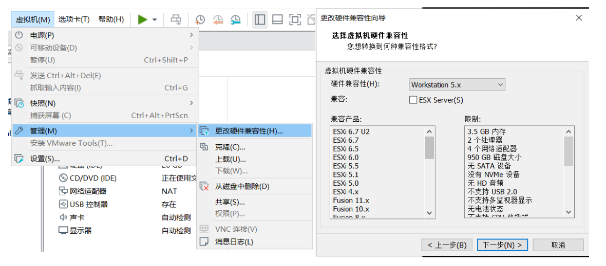

启动虚拟机时，在setup步骤中，网卡选择AMD LANCE，否则无法获得IP地址，其他可选择默认设置。安装完之后，输入shutdown，然后输入boot d0p0重启，后续关机都需输入shutdown，否则可能导致磁盘错误。

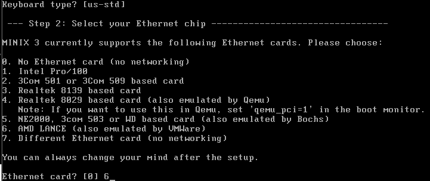

接着，输入mv /etc/rc.daemons.dist /etc/rc.daemons 。在网络模式为NAT 模式时，这样在重启后可以看到IP地址(若无法连接ftp，检查该 处是否修改)。

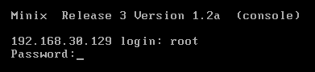

登录之后，在虚拟机终端输入 packman 安装额外的软件包，为了方便，选择全部安装:

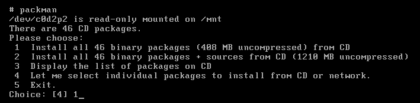

至此，实验的基本舞台终于搭建完毕了。

### 4.2相关的基本理论知识

在较早的 Minix3 版本中，内存管理机制是十分固定和清晰的。系统的进程管理器（Process Manager）维护一个空闲空间列表，根据内存地址从低到高排列：

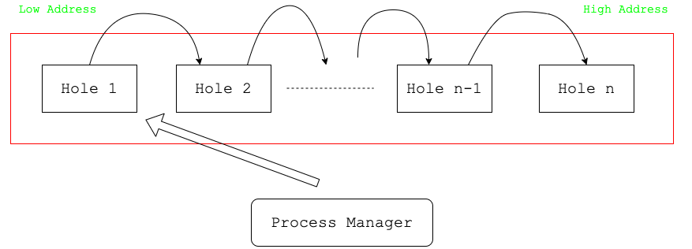

当一个进程请求内存时，进程管理器会采用最先匹配法在空闲列表中找到第一个符合要求的空闲区，并将其分配给该进程。一旦进程被装入内存后，该片内存空间就被固定了下来，不会再被扩展。Minix3 的程序大多被编译为进程的各个部分共用一个内存块的形式以方便作为一个整体进行加载，其中栈和数据/代码段分别位于内存空间的顶部和底部，整体结构大体如下：

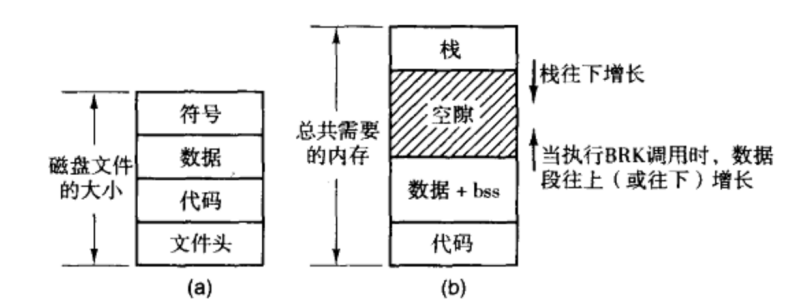

hole 空闲链表，按照内存地址的递增顺序列出了内存的各个空闲区域。不过数据段和栈段的空隙不认为是空闲区，因为它们已经被分配给了进程。

Minix 系统中的空闲块由一个链表来维护其元信息，其单元结构如下：

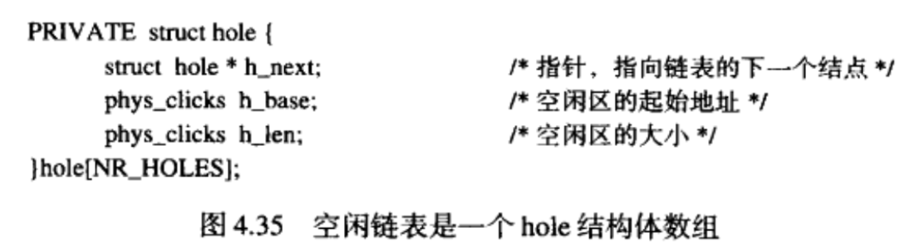

每个空闲区表项有3个字段：空闲区的起始地址，空闲区的长度，一个指针指向下一个链表结点。

有一个需要注意的是地址和长度都是以click为单位，click是1024个字节。

在 Minix3.1.2a 中，内存分配遵循首次适配原则（First-Fit），在遍历到第一个能够容纳该进程的空闲块时，便将这一空闲块分配给进程。

### 4.3将内存分配机制修改为Best-Fit

接下来我要按照实验要求来将内存的分配机制修改为最优适配原则（Best-Fit）。Best-Fit 原则需要遍历整个空闲块链表，找出与进程所需空间最接近的空闲块。

我们的工作主要围绕修改/usr/src/servers/pm/alloc.c中的alloc_mem函数展开。Minix维护的空闲链表是一个单向链表，所以我们只能从最头部开始，先遍历整个空闲内存块列表，找到最佳匹配的空闲块。然后一块分配给进程，一块给剩余的空闲区，仍然在空闲链表上，但长度要发生变化。如果块的大小正好合适，那么就要调用del_slot，把这个结点从空闲链表中删除。

flag用来标识是否找到了需要的内存块，以下代码实现了第一步，遍历并找到合适的块:

```c
    register struct hole *hp, *prev_ptr, *best, *prev_best;
    phys_clicks old_base,best_clicks;
    int flag=0;
    do {
        /* search from start */
        prev_ptr = NIL_HOLE;
        hp = hole_head;
        while (hp != NIL_HOLE && hp->h_base < swap_base){
            if (hp->h_len >= clicks){
                if (flag == 0){
                    /* first get fit block */
                    /* update */
                    best = hp;                      
                    prev_best = prev_ptr;           
                    best_clicks = hp->h_len;       
                    flag = 1;                  
                }else if (hp->h_len < best_clicks){
                    /* not first get fit block */ 
                    /* !!! this block is fitter */ 
                    /* update */ 
                    best = hp;
                    prev_best = prev_ptr;
                    best_clicks = hp->h_len;
                }
            }
            /* pass to next */ 
            prev_ptr = hp;
            hp = hp->h_next;
        }
    } while (swap_out());
    /* Try to find a process that can be swapped out.  
    Candidates are those blocked on a system call that PM handles, like wait(), pause() or sigsuspend().*/
```

然后就是将原来的那个空闲块分配后的更新操作了。由于best的基地址会发生改变，但是最后还要返回这个基地址用于使用，所以在更新之前要保存旧的基地址。

high_watermark是用来记录被使用的内存的最高的地址，如果超了要更新。而且不要忘记块的大小正好合适时，即空洞为0时的特判:

```c
    if (flag == 1) {
        old_base = best->h_base;
        /* update */     
        best->h_base += clicks;
        best->h_len -= clicks;

        if (best->h_base > high_watermark)high_watermark = best->h_base;
        if (best->h_len == 0)del_slot(prev_best,best); /* delete best */ 
        return(old_base);
    }

```

最后不能忘记了内存分配失败时的特判:

```c
    return(NO_MEM);/* special condition - no mem */
```

### 4.4内存申请行为修改

#### 4.4.1 adjust函数默认模式的修改

在 Minix3.1.2 中，原先的 adjust 函数中当栈段地址和数据段地址有重叠时直接返回 ENOMEM, do_brk 不能继续为数据段增加空间，也就是说一旦进程使用完了分配的空间，程序便将报错退出:

```c
if (lower < gap_base) return(ENOMEM); /* data and stack collided */
```

lower 为栈顶指针，gap_base 为数据段的边界，如果lower<gap_base 则说明栈段和数据段发生了冲突，当前空闲空间不够分配，因此调用 allocate_new_mem函数分配新的空间。

现在我们需要修改/usr/src/servers/pm/break.c中的adjust函数，并增加了一个 allocate_new_mem局部函数在adjust函数中调用。其中brk系统调用流程是这样的:do_brk函数计算数据段新的边界，然后调用adjust函数，adjust函数计算程序当前的空闲空间是否足够分配：

- 若足够，则调整数据段指针，堆栈指针；通知内核程序的映像发生了变化，返回do_brk函数。 


- 若不够，调用allocate_new_mem函数申请新的足够大的内存空间；将程序现有的数据段和堆栈段的内容分别拷贝至新内存区域的底部(bottom)和顶部(top)；通知内核程序的映像发生了变化；返回do_brk函数。


首先，我要在adjust函数中添加有一句重要的代码:

```c
  if (lower < gap_base) /* data and stack collided */    
  if (allocate_new_mem(rmp, (phys_clicks)(mem_sp->mem_vir + mem_sp->mem_len - mem_dp->mem_vir)) == ERROR)
    return(ENOMEM); 
```

这意味着程序空间不足时调用allocate_new_mem函数来实现内存空间的更新，因此我们的重点应该是接下来对实现allocate_new_mem的相关功能。

#### 4.4.2 allocate_new_mem的实现

##### 4.4.2.1 运行逻辑

其实，实验文档里的这张图也很好地诠释了我们的任务:

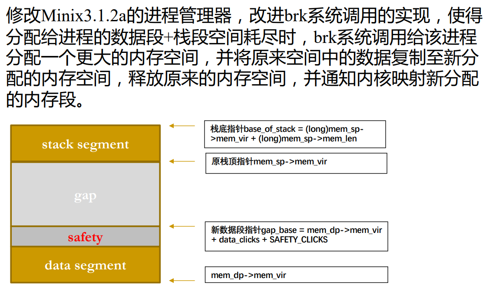

1. allocate_new_mem函数首先需要申请新的足够大的内存空间，这里我申请的是原来的2倍，然后将程序现有的数据段、堆栈段的内容分别拷贝至新内存区域的底部(bottom)和顶部(top)；通知内核程序的映像发生了变化；返回do_brk函数。


2. 接下来，就是我调用sys_memset函数用0填充新获得的内存，这样做是为了防止干扰。

3. 然后就是内存内容拷贝环节，机械地模拟显然是笨拙的，Minix 提供了一个现成的 sys_abscopy 函数供我们使用。在成功扩容之后，我们只需要正确地调用sys_abscopy将栈段和数据段的内容分别复制到新的内存区，并且修改进程表中记录的栈段与数据段的虚拟地址和物理地址。注意，其中数据段的虚拟地址不用进行修改，因为在minix 中代码段与数据段和栈段是分开管理的，数据段虚拟地址是零。

- sys_abscopy函数传入的第一个参数为对象的旧地址，第二个参数为对象的新地址，第三个参数为总的字节数。


- free_mem 传入的第一个参数是释放空间的起始地址，第二个参数是空间大小。

4. 与3类似，Minix 提供了free_mem函数供我们内存释放，我们正确地调用它，进行原有内容的释放即可

##### 4.4.2.2 细节

(一)**注意以上使用这些函数的时候是以字节为单位的，而不是以click为单位，因此在相应的操作之前要进行转化过程。clicks左移CLICK_SHIFT位就可以进行click到byte的单位转换。**

(二)我比较好奇Minix管理进程的相关机制，在查阅了一些资料后，发现minix将进程的栈段和数据段基地址存放在其进程管理表（Process Management Table）中，这个在servers/pm/mproc.h中能找到对应的mproc结构体，它内部有一个mem_map类型的成员mp_seg:

```c
EXTERN struct mproc {
    struct mem_map mp_seg[NR_LOCAL_SEGS]; /* points to text, data, stack */
}
```

其中mp_seg[1]表示数据段基地址，mp_seg[2]表示栈段的基地址，两者参考这个文件里其他函数的实现，分别也可以用mp_seg[D]和mp_seg[S]来表示。我们可以直接读取这两者，然后根据新分配的空间大小计算出新的基地址。

(三)我们主要是针对数据段进行扩容，对于栈段只用复制即可，扩容前后栈的大小不发生改变。新的栈段的地址计算方法:


（四）allocate_new_mem之后的相关工作。

adjust 函数记录下了栈段和数据段的地址、长度改变量。判断新的栈段、数据段大小是否适合地址空间，若适合则调用sys_newmap函数更新虚拟地址到物理地址的映射，并调用 free_mem 释放旧的空间；若不适合则恢复栈段、数据段到旧的空间。

```c
  old_clicks = mem_dp->mem_len;
  if (data_clicks != mem_dp->mem_len) {
	mem_dp->mem_len = data_clicks;
	changed |= DATA_CHANGED;
  }

  /* Update stack length and origin due to change in stack pointer. */
  if (delta > 0) {
	mem_sp->mem_vir -= delta;
	mem_sp->mem_phys -= delta;
	mem_sp->mem_len += delta;
	changed |= STACK_CHANGED;
  }
  /* Do the new data and stack segment sizes fit in the address space? */
  ft = (rmp->mp_flags & SEPARATE);
#if (CHIP == INTEL && _WORD_SIZE == 2)
  r = size_ok(ft, rmp->mp_seg[T].mem_len, rmp->mp_seg[D].mem_len, 
       rmp->mp_seg[S].mem_len, rmp->mp_seg[D].mem_vir, rmp->mp_seg[S].mem_vir);
#else
  r = (rmp->mp_seg[D].mem_vir + rmp->mp_seg[D].mem_len > 
          rmp->mp_seg[S].mem_vir) ? ENOMEM : OK;
#endif
  if (r == OK) {
	int r2;
	if (changed && (r2=sys_newmap(rmp->mp_endpoint, rmp->mp_seg)) != OK)
  		panic(__FILE__,"couldn't sys_newmap in adjust", r2);
	return(OK);
  }

  /* New sizes don't fit or require too many page/segment registers. Restore.*/
  if (changed & DATA_CHANGED) mem_dp->mem_len = old_clicks;
  if (changed & STACK_CHANGED) {
	mem_sp->mem_vir += delta;
	mem_sp->mem_phys += delta;
	mem_sp->mem_len -= delta;
  }
  return(ENOMEM);
```

##### 4.4.2.3 代码

我们只用沿着刚刚的逻辑一步步地实现allocate_new_mem即可:

```c
PUBLIC int allocate_new_mem(rmp,clicks) 
register struct mproc *rmp; 
phys_clicks clicks; {
    /* Process Management Table */
    /*clicks: old clicks*/
    int copy_stack,copy_data;
    register struct mem_map *mem_sp, *mem_dp;/* point to stack,data part */
    /* we mainly expand the data segment, not stack */
    /* data part */
    phys_clicks old_data_clicks,new_data_clicks;
    phys_clicks old_data_base,new_data_base;
    /* stack part */
    phys_clicks stack_clicks;
    phys_clicks old_stack_base,new_stack_base;

    /* convert to bytes version */
    phys_bytes old_data_bytes, new_data_bytes;
    phys_bytes stak_bytes;
    phys_bytes old_data_base_bytes, new_data_base_bytes;
    phys_bytes old_stack_base_bytes, new_stack_base_bytes;


    mem_dp = &rmp->mp_seg[D]; /* point to data part */
    mem_sp = &rmp->mp_seg[S]; /* point to stack part */
    old_data_clicks = clicks;
    new_data_clicks = clicks*2;
    stack_clicks = mem_sp->mem_len;
    /* use alloc_mem */
    /* if fail, don't free */
    if ((new_data_base = alloc_mem(new_data_clicks))==NO_MEM){
        /* printf("allocate error!"); */
        return (ENOMEM);
    }


    /* convert click -> byte */
    new_data_bytes = (phys_bytes) rmp->mp_seg[D].mem_len << CLICK_SHIFT;
    stak_bytes = (phys_bytes) rmp->mp_seg[S].mem_len << CLICK_SHIFT;

    old_data_base = rmp->mp_seg[D].mem_phys;
    old_stack_base = rmp->mp_seg[S].mem_phys;

    old_data_base_bytes = (phys_bytes)old_data_base << CLICK_SHIFT;
    old_stack_base_bytes = (phys_bytes)old_stack_base << CLICK_SHIFT;


    /* update */
    new_stack_base = new_data_base + new_data_clicks - stack_clicks;
    new_stack_base_bytes = (phys_bytes)new_stack_base << CLICK_SHIFT;
    new_data_base_bytes = (phys_bytes) new_data_base << CLICK_SHIFT;


    sys_memset(0,new_data_base_bytes,(new_data_clicks<<CLICK_SHIFT));

    copy_data = sys_abscopy(old_data_base_bytes,new_data_base_bytes,new_data_bytes);  
    if (copy_data < 0) panic(__FILE__,"allocate_new_mem can't copy",copy_data); 
    copy_stack = sys_abscopy(old_stack_base_bytes,new_stack_base_bytes,stak_bytes); 
    if (copy_stack < 0) panic(__FILE__,"allocate_new_mem can't copy",copy_stack); 

    rmp->mp_seg[D].mem_phys = new_data_base;

    rmp->mp_seg[S].mem_phys = new_stack_base; 
    rmp->mp_seg[S].mem_vir = rmp->mp_seg[D].mem_vir + new_data_clicks - mem_sp->mem_len;
    
    free_mem(old_data_base,old_data_clicks); 
    return (OK);
}
```

### 4.5性能测试

进入 /usr/src/servers 目录, 输入 make image, 编译成功后输入 make install 安装新的PM程序。

进入/usr/src/tools目录，输入make hdboot, 成功之后再键入make install 命令安装新的内核程序。

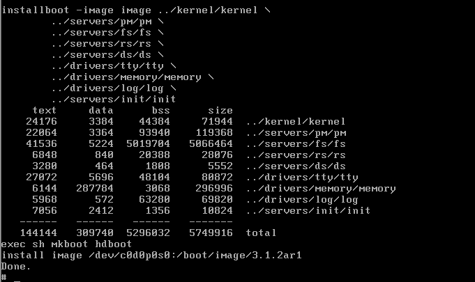

键入shutdown 命令关闭虚拟机，进入boot monitor界面。设置启动新内 核的选项，在提示符键入： 

newminix(5,start new kernel) {image=/boot/image/3.1.2ar1;boot;}

然后回车，键入save命令保存设置。 

（5为启动菜单中的选择内核版本 的键(数字键，可选其他数字键)，3.1.2ar1为在/usr/src/tools目录中输入 make install 之后生成的内核版本号，请记得在/usr/src/tools中执行 make install命令之后记录生成的新内核版本号。）

输入menu命令，然后敲数字键5启动新内核， 登录进minix 3中测试。

以下是两个测试程序:

test1.c

```c
#include <stdio.h>
#include <unistd.h>

int inc = 1;
int total = 0;
char *sbrk(int incr); /* should be in unistd, but isn't */
char *result;

int main(int argc, int **argv)
{
       while (((int)(result = sbrk(inc))) >= 0)
       {
              total += inc;
              printf("incremented by %d, total %d , result + inc %d\n", inc, total, inc + (int)result);
              inc += inc;
       }
       return 0;
}

```

test1是使用 sbrk 调用对内存分配进行基本的测试。

test2.c

```c
#include <stdio.h>
#include <unistd.h>

int inc = 1;
int total = 0;
char *sbrk(int incr);
char *result;
int i;

int main(int argc, int **argv)
{
    while (((int)(result = sbrk(inc))) > 0)
    {
        for (i = 0; i < inc; i++)
            result[i] = 0x12;
        total += inc;
        printf("incremented by: %d, total: %d , result: %d\n", inc, total, (int)result);
        inc += inc;
    }
    exit(0);
    return 0;
}

```

test2实际访问新分配的内存，验证其分配空间是否能够正常使用.

经过测试，程序输出与预期一致:

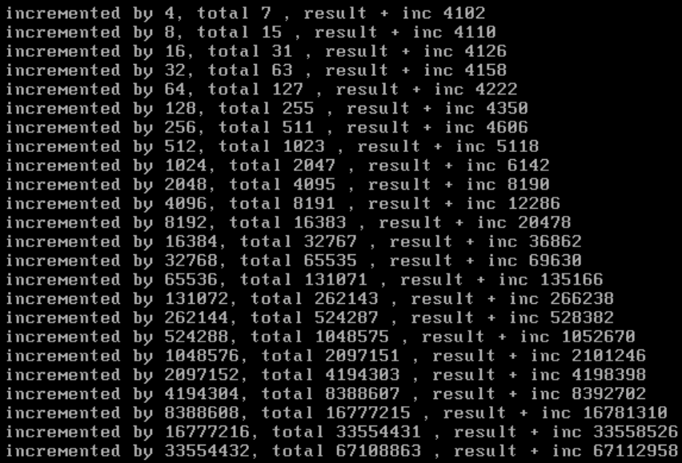

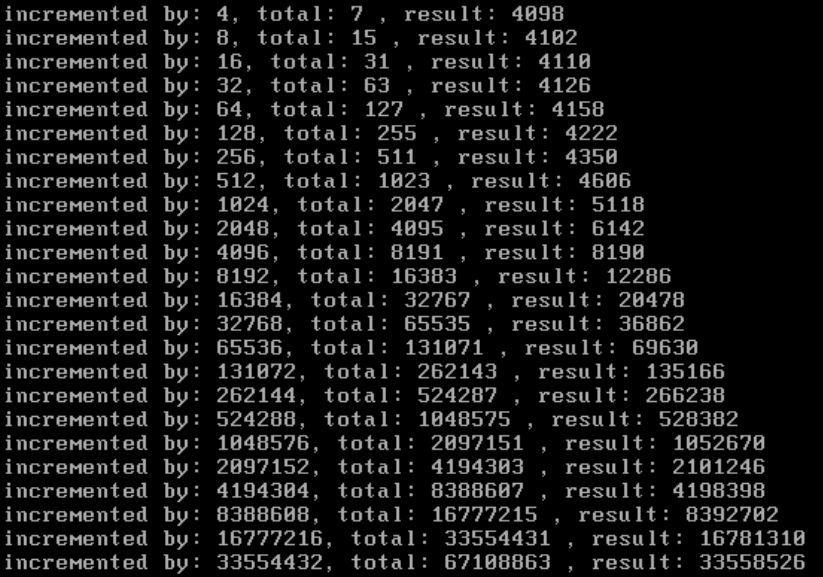

由于屏幕的大小限制，前两行并没有展示出来。

## 5.总结

在本实验中，我在 Minix3.1.2a 系统下对内存分配机制进行了修改。首先我修改了Minix的内存分配机制为 best-fit，有效提高内存的综合利用率，减少内存碎片的产生(虽然这样运行时间上并不占优势)。接着我修改了内存申请行为，使得内存空间随着需求动态扩展， 极大的增强了系统的通用性和可扩展性。这一实验加深了我对进程内存管理和内存空间调 度的相关知识有了更深刻的了解。

即使其中的调试过程是枯燥乏味的，面对cc编译器的严格语法要求很容易就出现各种各样的报错，但是在看到自己修改之后的结果，我还是感到由衷的有收获感。

