## 
  《操作系统》第三次作业 

10211900416 郭夏辉

题目: 《操作系统设计与实现》第三章3,4,11,12,14,15,17,22,28题

## 3

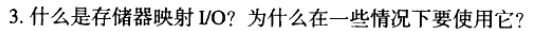

存储器映射I/O(memory-mapped I/O)，简称为内存映射I/O。I/O设备被映射到了内存空间而不是I/O空间中，被分配了唯一的内存地址。从CPU的角度来看，内存映射I/O后系统设备访问起来和内存一样。

这样访问BIOS，PCI等设备就可以使用读写内存一样的汇编指令完成，而不是使用read,write这样的I/O函数，简化了程序设计的难度和接口的复杂性。

## 4

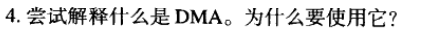

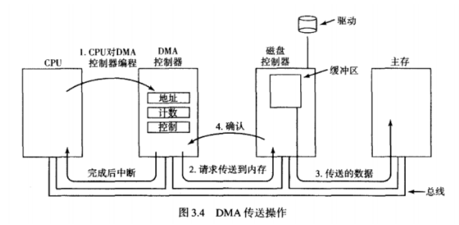

DMA(Direct Memory Access)，直接存储器访问。

将数据从一个地址空间复制到另一个地址空间时，DMA提供了外设和存储器之间或者存储器和存储器之间的高速数据传输。CPU只需要介入I/O操作的开始和结束，剩下的传输主体过程交给DMA控制器就行。这可以有效地提升数据传输效率，也减轻CPU负担。

## 11

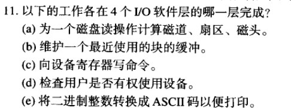

(a)设备驱动程序

(b)设备无关软件

(c)设备驱动程序

(d)设备无关软件

(e)用户进程

## 12

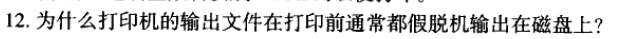

如果一个用户进程占用打开代表打印机的字符设备文件，但却长时间不使用，那么其他进程有打印需要也不能打印。

因此，将需要打印的文件假脱机输出在磁盘上，由守护进程打印文件，防止用户进程直接使用打印机，可以使得某些进程无法不必要地占据打印机进而影响其他进程。

## 14

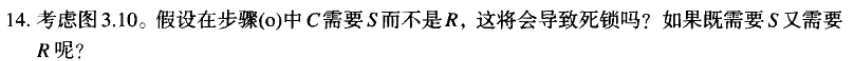

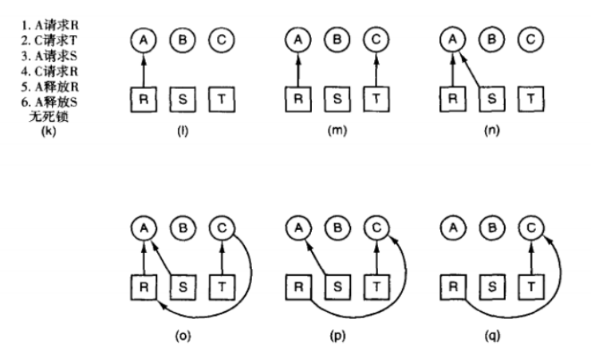

如果C需要S而不是R，不会导致死锁。

因为进程A已经执行完，资源S可以被释放并分配给C。 

如果C既需要S又需要R，不会导致死锁。

因为进程A已经执行完，资源S和R都可以释放并分配给C，C执行完成后，再分配给进程B。

## 15

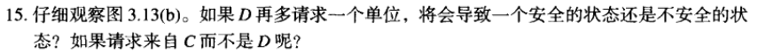

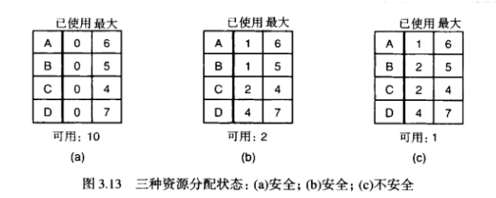

D再多请求一个单位，状态仍然是安全的。

可用的两个单位可以先让C完成，然后释放出其占用的资源，再让 D、B、A 依次完成。

C再多请求一个单位，状态不安全。此时可用资源只有两个单位，此时A、B、C、D 四个都不能满足要求。

## 17

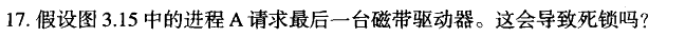

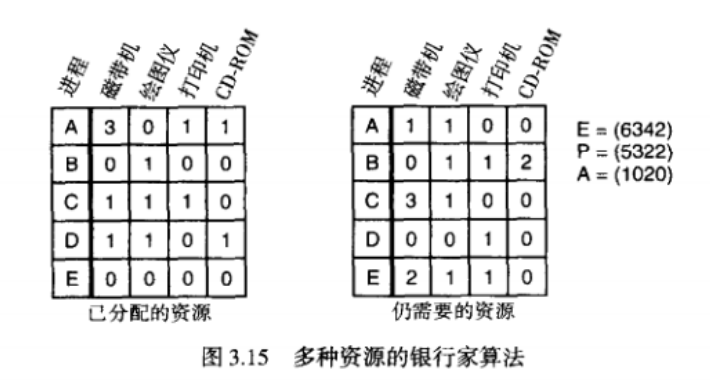

不会导致死锁

若立即满足 A 的请求，则可用资源向量减为A=(0020)。

再将每个进程所需要的资源与可用资源向量作比较，进程 D 可以执行，执行结束后释放出它所占有的资源，进程 A、B、C、E 也可以依次执行结束。

因此，所得到的系统状态仍然是安全的，不会导致死锁。

## 22

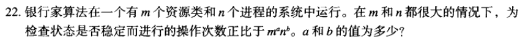

为了判断矩阵中是否存在一行使得它所需要的资源都小于等于资源向量的各分量，需要分别遍历$n$个进程后再遍历其$m$个资源，所需时间为$Θ(nm)$.然后不断迭代，需要将$n$个进程都经过类似的遍历，获取资源后释放资源、标记结束，所需时间为$Θ(m\sum_{i=1}^{n}i)=Θ(mn^2)$

故$a=1,b=2$

## 28

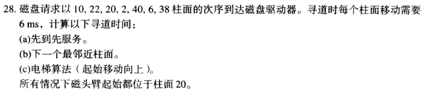

(a)先到先服务

选择请求的顺序为:10，22，20，2，40，6，38

磁盘臂移动的柱面数依次为:10，12，2，18，38，34，32

寻道时间：$(10+12+2+18+38+34+32)×6=876ms$

(b)下一个最邻近柱面

选择请求的顺序为：20，22，10，6，2，38，40（其实柱面是20）

寻道时间：$(0+2+12+4+4+36+2)×6ms=360ms$

(c)电梯算法

选择请求的顺序为：20，22，38，40，10，6，2

寻道时间：$(0+2+16+2+30+4+4)×6ms=348ms$
