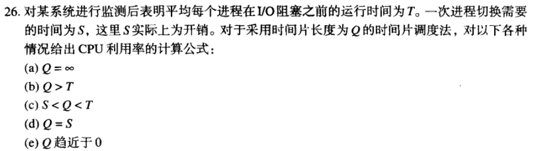

## 
  《操作系统》第二次作业 

10211900416 郭夏辉

题目: 《操作系统设计与实现》第二章2, 4, 7, 8, 9, 17, 23, 26, 27, 28, 33, 38题

### 2

运行态：该时刻进程实际占用处理机并正在运行。

就绪态：进程等待获取运行所需的处理机资源而被暂时挂起。

阻塞态：除非某种外部事件发生，否则不能运行。

### 4

像C语言这样的高级语言不被允许直接访问CPU等硬件，而这种访问是中断处理所必需的。中断处理程序可能需要打开或关闭某个特定设备的中断服务，这都是高级语言无法完成的。而且，采用汇编语言编写的中断处理程序可以更加高效地执行。

### 7

- 进程是一组相关资源的集合。

进程是一个具有一定独立功能的程序在一个数据集上的一次动态执行的过程，是操作系统进行资源分配和调度的一个独立单位，是应用程序运行的载体。

进程有一个存放程序和数据以及其他资源的地址空间，以进程形式把各种资源整合在一起，方便进行管理。

- 线程是进程中的一个执行流。

线程是程序执行中一个单一的顺序控制流程，是程序执行流的最小单元，是处理器调度和分派的基本单位。

线程有一个独立的程序计数器，用来跟踪下一条将要执行的指令。它有独立的寄存器，存储当前使用的变量。它也有独立的堆栈，存储着执行的历史，其中每一栈帧保存了没有返回的过程调用。但同一进程下的各个线程之间共享程序的内存空间(包括代码段、数据集等)及一些进程级的资源(如打开文件和信号)，某进程内的线程在其它进程却不可见。

一个进程可以有一个或多个线程，各个线程之间共享程序的内存空间(也就是所在进程的内存空间)。一个标准的线程由线程ID、当前指令指针(PC)、寄存器和堆栈组成。而进程由内存空间(代码、数据、进程空间、打开的文件)和一个或多个线程组成。

尽管线程必须在进程中执行，但线程和它的进程是可以分别对待处理的两个不同概念。进程用来集合资源，而线程是CPU中的调度的实体。线程上下文切换比进程上下文切换要快得多。

### 8

每个线程都有自己的调用例程，因此它必须有其自己的堆栈以保存局部变量、返回地址等数据。

### 9

两个或多个进程读写某些共享数据，而最后的结果取决于进程运行的精确时序，就称为竞争条件。

### 17

不会发生这种情况了。

如果采用时间片调度，每个进程都被分配一个时间片。如果在时间片结束时该进程还在运行，则CPU将取消它的执行权并将执行权分配给另一个进程。如果进程在时间片结束前阻塞或结束，则CPU立刻进行执行权的切换。还有一条规则，就是当进程用完它的时间片后，它被移到该运行队列的末尾。

通过这样的方式，进程H陷入死循环的方式不会发生，因为进程L或早或晚一定会发生，而且最终也一定会交出执行权，离开临界区。

### 23

读者－写者问题，为数据库访问建立了一个模型。多个进程同时读是可以接受的，但如果一个进程正在更新数据库，则所有其他进程都不能访问数据库，即使读操作也不行。

1.**读者优先**。

当读者等待时，写者都无法启动。写者要等到所有读者结束读取，才开始写。若有一个写者完成了写操作，则无论是否还有写者存在或等待，读者都不需要排队等待，直接开始读。

2.**写者优先**。

当有写者等待时，读者都不会开始。当有写者正在运行时，则要等到所有的写操作结束后才能开始读。若有一个读者完成了读取操作后，如果有写者存在或等待，直接启动写者开始对应的写操作。

3.**读写平衡**。

一旦开始读，就一直读到没有读者为止。与之类似，一旦开始写，就一直写到没有写者为止。

### 26

CPU的效率就是有用的CPU时间除以整个的CPU时间。当Q > T时，基本的周期就是进程运行T，然后进程切换S，因此（a）和（b）的效率都是$\frac{T}{T+S}$。

当时间片Q比T短时，每运行一次T就要求T/Q次进程切换，浪费时间为ST/Q，因此（c）中效率为$\frac{T}{T+\frac{ST}{Q}}=\frac{Q}{Q+S}$.

以S替代Q，就可以计算出（d）中效率为50%。

最后，通过类似的方法，对（c）中的方法取极限，可得（e）的效率趋于0。

### 27

最短作业优先可以使得平均响应时间最短

如果0 < X ≤ 3: X, 3, 5, 6, 9.

如果3 < X ≤ 5: 3, X, 5, 6, 9.

如果5 < X ≤ 6: 3, 5, X, 6, 9.

如果6 < X ≤ 9: 3, 5, 6, X, 9.

如果X > 9: 3, 5,6, 9, X.

### 28

(a)时间片轮转.

在前10分钟，每个作业获得1/5的CPU时间。

在第10分钟时，C结束。

在10-18分钟，每个作业获得 1/4 的CPU时间。

在第18分钟时，D结束。

在18-24分钟，每个作业获得 1/3 的CPU时间。

在第24分钟时，B结束。

在24-28分钟，每个作业获得 1/2 的CPU时间。

在第28分钟时，E结束。

在28-30分钟，每个作业获得全部的CPU时间。

在第30分钟时，A结束。

平均进程周转时间是$\frac{10+18+24+28+30}{5}=22$分钟

(b)优先级调度.

运行顺序是B-E-A-C-D

B最先运行，6分钟完成。

其它进程分别在第14, 24, 26和30分钟完成

平均进程周转时间$\frac{6+14+24+26+30}{5}=20$分钟

(c)先来先服务.

运行顺序是A-B-C-D-E

各进程的完成事件分别是10,16,18,22,30分钟

平均进程周转时间$\frac{10+16+18+22+30}{5}=19.2$分钟

(d)最短作业优先.

运行顺序是C-D-B-E-A

各进程的完成事件分别是2,6,12,20,30分钟

平均进程周转时间$\frac{2+6+12+20+30}{5}=14$分钟

### 33

答：所使用的 CPU 的片为 $\frac{35}{50}+ \frac{20}{100} + \frac{10}{300} + \frac{x}{250}$。为了使进程可调度，必须使得总和不超过1。解得$x\leq \frac{50}{3} ms$.

### 38

不会发生饥饿。

系统任务和服务器进程优先级较高，分配到的时间片也更大，但是如果运行的时间过长，也是会被抢占的。而且从整体上来看，它们常常处于阻塞状态，它们的使用是由用户进程发起的；在相应的工作完成后，它们也会把执行权还给用户进程。

在这样的条件下，虽然用户进程时间片分配的较小，所处的优先级队列也较低，但是并不会发生饥饿现象。