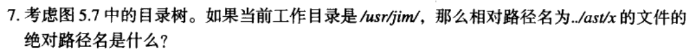
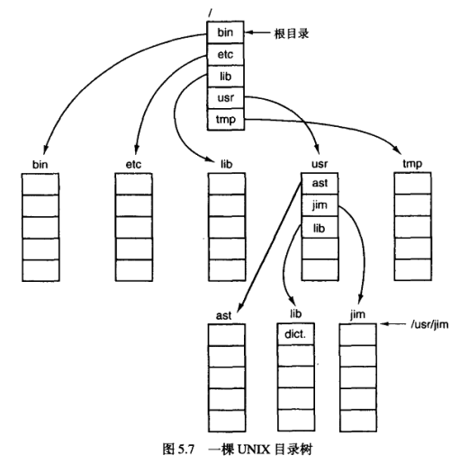
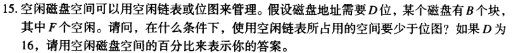
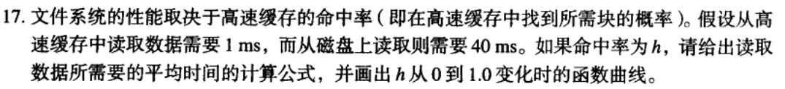
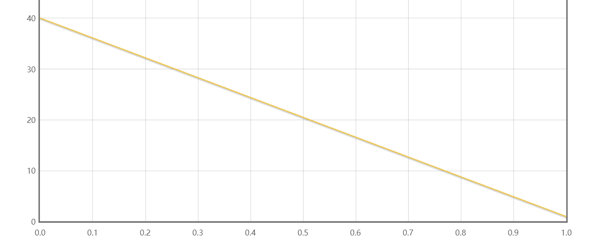
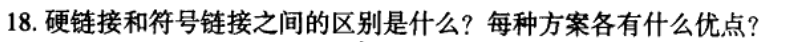
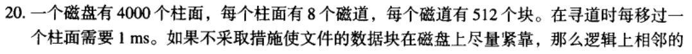
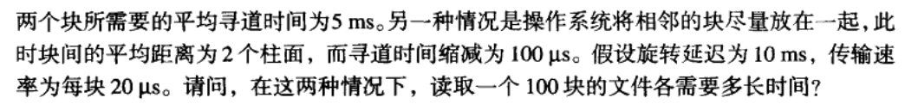
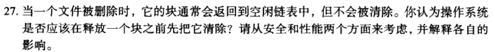

## 
  《操作系统》第五次作业 

10211900416 郭夏辉

题目: 《操作系统设计与实现》第五章7,15,17,18,20,27题

7

../ast/x的绝对路径名是/usr/ast/x

15

位图需要B位，空闲链表需要$D_1$位

如果空闲链表所占用的空间少于位图，$D_1<B$ 即$\frac{F}{B}<\frac{1}{D}$

代入数据，可以得到空闲磁盘空间百分比$\frac{F}{B}<\frac{1}{16}=6.25\% $

17

$T=h+40(1-h)=-39h+40$

18

硬链接

多个指针指向一个文件元数据(比如文件索引i-node)，是同一文件的不同访问路径。 

优点:由于直接访问文件本身，性能上具有很大的优势。

符号链接

是一个额外的小文件，包含了真实文件的路径。

优点:可以跨越不同的文件系统。

20

总时间=寻道时间+旋转时间+传输时间

第一种情况:

寻道时间=$5*100=500ms$

旋转时间=$(10/2)*100=500ms$

传输时间=$0.02*100=2ms$

总时间=$1002ms$

第二种情况:

这个题目其实挺复杂的。

寻道时间=$0.1*100=10ms$

旋转时间=$(10/2)*100=500ms$

传输时间=$0.02*100=2ms$

总时间=$512ms$

27

从安全角度来说，被删除的块可能具有敏感数据，如果不被真的清除也许会被非法利用；

从性能角度来说，如果在文件删除时真的把它清除掉了而不是放到那个空闲链表中，这样会带来很多额外的磁盘读写操作，增大硬盘I/O负担，进而损耗了系统的性能。

总而言之，这种方法会带来性能上的增益效果，但是应当注意定期地清除空闲链表中的数据块之数据，并且还要注意把握这个清理的频率。
