## 
  《操作系统》第四次作业 

10211900416 郭夏辉

题目: 《操作系统设计与实现》第四章2, 6, 11, 12, 14, 18, 23, 24, 27, 30题

## 2

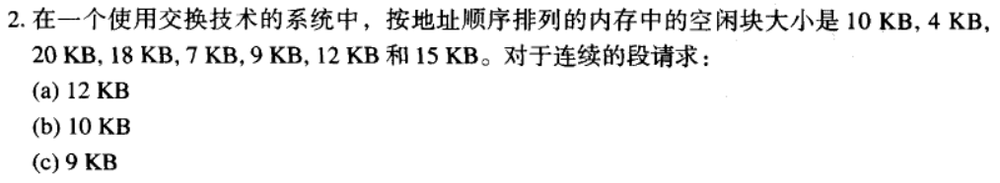

如果使用最先匹配算法，按照起始地址升序寻找，只要找到一个匹配的空闲块就停止寻找，因此选中的空闲块依次是20KB，10KB，18KB。

如果使用最佳匹配算法，从头到尾遍历空闲块链表，直到找到一个大于等于且最接近需求的空间的块，因此选中的空闲块依次是12KB，10KB，9KB。

如果使用最坏匹配算法，采用的策略与最佳匹配算法相反，因此选中的空闲块依次是20KB，18KB，15KB。

如果使用下次匹配算法，与最佳匹配算法类似，但是每次遍历并不是从空闲块链表头部开始，而是从上次被分配的空闲块的下一个空闲块开始，因此选中的空闲块依次是20KB，18KB，9KB。

## 6

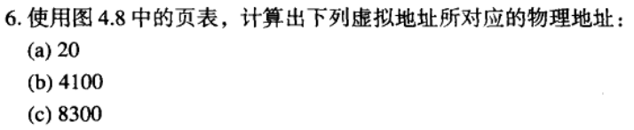

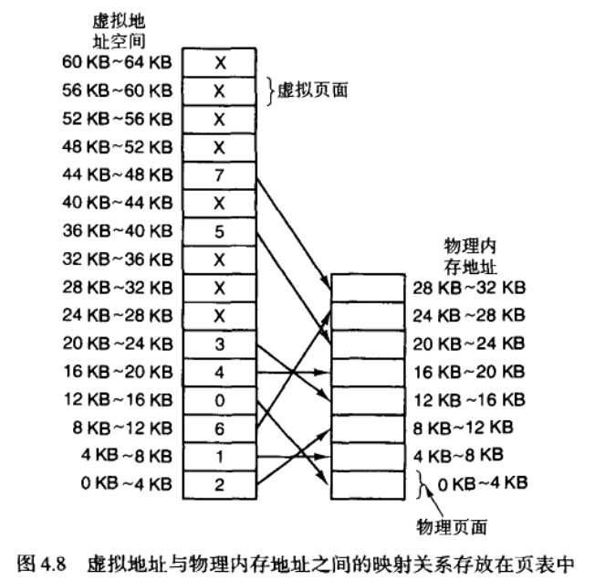

a.虚拟地址20在第0个虚拟页面，页面内的偏移地址为20，被映射到第2个物理块，起始地址为8192，最后的物理地址为8192 + 20 = 8212

b.虚拟地址4100在第1个虚拟页面，页面内的偏移地址为4100-4096=4，被映射到第1个物理块，起始地址为 4096，最后的物理地址为4096 + 4 = 4100

c.虚拟地址8300在第2个虚拟页面，页面内的偏移地址为8300-8192=108，被映射到第6个物理块，起始地址为 24576，最后的物理地址为24576 + 108 = 24684

## 11

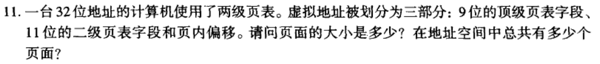

32-(9+11)=12 页内偏移地址有12 位，页面的大小为$2^{12}bytes=4KB$

地址空间页面总数$2^{9}*2^{11}=2^{20}$

## 12

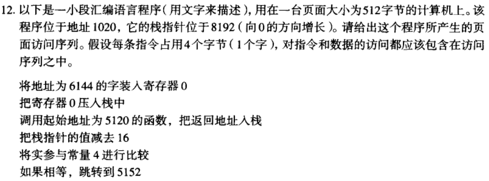

页面访问序列为:

1（指令）$\lfloor \frac{1020}{512} \rfloor=1$

12（数据）$\lfloor \frac{6144}{512} \rfloor=12$

2（指令）$\lfloor \frac{1024}{512} \rfloor=2$

15（数据）$\lfloor \frac{8188}{512} \rfloor=15$

2（指令）$\lfloor \frac{1028}{512} \rfloor=2$

15（数据）$\lfloor \frac{8184}{512} \rfloor=15$

10（指令）$\lfloor \frac{5120}{512} \rfloor=10$ 

栈指针是一个寄存器，这里无内存访问

10（指令）$\lfloor \frac{5124}{512} \rfloor=10$

15（数据）$\lfloor \frac{8188}{512} \rfloor=15$

此时的参数是存放在栈中的，原本在内存地址6144 处的数据

10（指令）$\lfloor \frac{5128}{512} \rfloor=10$

## 14

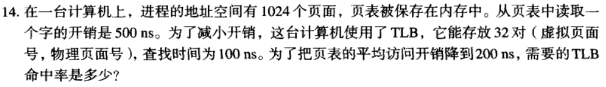

设 TLB 的命中率为 $p$

根据题意，有$100p+500(1-p)\leq200$

解得$p\geq0.75$

即为了把页表的平均访问开销降到 200ns,TLB 的命中率应该不低于为 75%

## 18

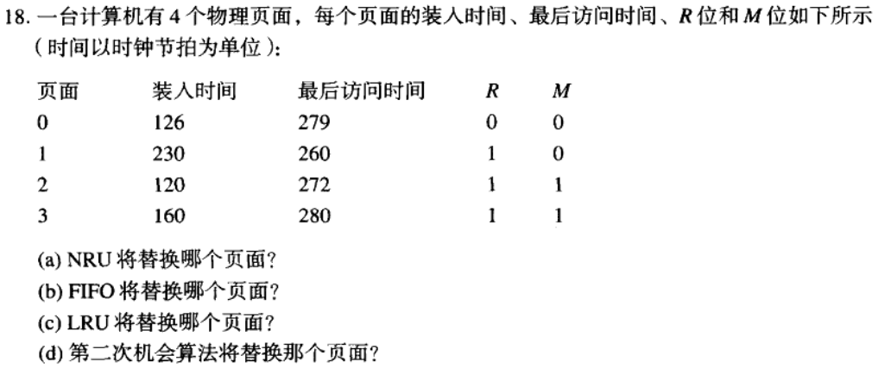

(a)如果使用最近未使用算法，我们要找一个页面R为0，M也为 0，所以将替换页面0

(b)如果使用FIFO算法，我们挑选最开始进入的页面进行替换，这里装入时间最早的是2，所以将替换页面2

(c)如果使用LRU算法，我们挑选最近最久未使用的页面进行替换，这里最后访问时间中最小的是页面 1，所以将替换页面1

(d)如果使用第二次机会算法，与FIFO类似，我们应该检查最先进入页面的R位，检查其是否最近被访问过，0就置换，1就先把R清零，再将该页面放到最后，修改其装入时间，再继续搜索。最先进入的页面是2，它初始时得R为1，暂时不能替换，然后第二先进入得页面是0，它的R为0，可以使用，所以将替换页面0

## 23

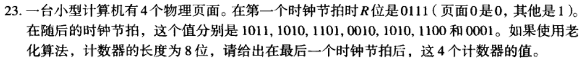

| |0111| 1011| 1010| 1101| 0010 |1010| 1100 |0001 |
| ---- | ---- | ---- | ---- | ---- | ---- | ---- | ---- | ---- |
|0| 00000000 |10000000 |11000000 |11100000| 01110000 |10111000 |11011100| 01101110|
|1| 10000000| 01000000| 00100000 |10010000| 01001000| 00100100| 10010010| 01001001 |
|2| 10000000 |11000000| 11100000| 01110000| 10111000 |11011100 |01101110| 00110111 |
|3| 10000000| 11000000| 01100000| 10110000| 01011000| 00101100| 00010110 |10001011|

因此这4个计数器最终的值为01101110、01001001、00110111、10001011

## 24

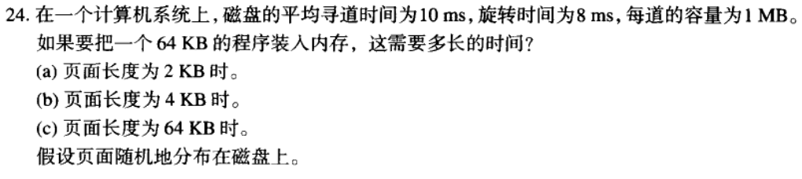

平均旋转时间是旋转一圈的时间的一半，即$4ms$

a.

页面数$\frac{64}{2}=32$

每个页面的传送时间$(\frac{2KB}{1MB})*8ms=0.016ms$

总时间$32*(10+4+0.016)=32*14.016=448.512ms$

b.

页面数$\frac{64}{4}=16$

每个页面的传送时间$(\frac{4KB}{1MB})*8ms=0.032ms$

总时间$16*(10+4+0.032)=16*14.032=224.512ms$

c.

页面数$\frac{64}{64}=1$

每个页面的传送时间$(\frac{64KB}{1MB})*8ms=0.512ms$

总时间$1*(10+4+0.512)=1*14.512=14.512ms$

## 27

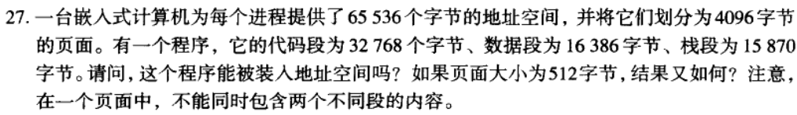

a.

页面大小4096bytes

页面数$\frac{65536}{4096}=16$

代码段所需页面$\lceil\frac{32768}{4096}\rceil =8$

数据段所需页面$\lceil\frac{16386}{4096}\rceil =5$

栈段所需页面$\lceil\frac{15870}{4096}\rceil =4$

$8+5+4=17>16$

不能被装入

b.

页面大小512bytes

页面数$\frac{65536}{512}=128$

代码段所需页面$\lceil\frac{32768}{512}\rceil =64$

数据段所需页面$\lceil\frac{16386}{512}\rceil =33$

栈段所需页面$\lceil\frac{15870}{512}\rceil =31$

$64+33+31=128$

能被装入

## 30

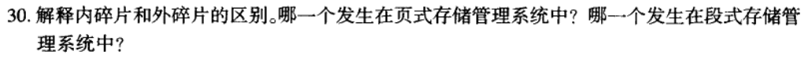

内碎片：分配给某进程的内存区域当中没有被利用的内存空间，是已经被分配出去却不能被利用的内存空间。在进程释放它，或进程结束之前，系统无法利用它。

外碎片：内存中的某些空闲分区由于太小而难以利用，无法分配给申请内存空间的新进程。这些存储块的总和是可以满足当前申请的长度要求的，但是由于它们的地址不连续或其他原因，使得系统无法满足当前申请。

内碎片发生在页式存储管理系统中，外碎片发生在段式管理系统中。
